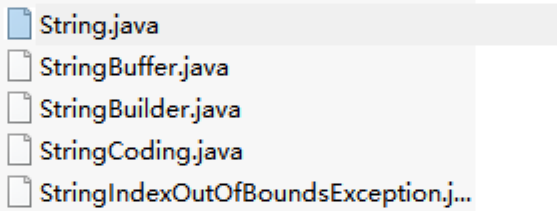

# String类

## **String类简介**

Sting是整个系统开发中至关重要的组成类，在java中所有的字符串都要求使用双引号进行定义，同时也可以利用”+“进行字符串的连接处理

字符串不能算是一个基本数据类型，没有任何一门语言提供有字符串这种数据类型，而java中为了方便开发者进行项目的编写，所以利用JVM的支持制造了一种可以简单使用的String，并且可以像基本数据类型那样进行直接赋值处理。

**范例：**String类对象实例化

```java
public class StringDemo {
    public static void main(String args[]){
        String str = "www.mldn.cn"; // 直接赋值
        System.out.println(str);
    }
}
```

需要注意的是，String类之所以可以保存字符串主要的原因是其中定义了一个数组，也就是说在Sting里所有的字符串中的每一个字符的数据都是保存在了数组之中

- 源代码目录
- 

从jdk1.9开始String类中的数组类型采用了byte类型（字节数组），jdk1.8Strig类保存的是字符数组 private final char value[];

**所谓的字符串就是对数组的一种特殊包装应用，但是既然包装的是数组，所以字符串中的内容一定是无法改变的。**

另外需要注意的是，在String类中除了可以使用直接赋值的形式为对象进行实例化之外，也可以按照传统的方式利用构造方法进行对象实例化处理：public String(String str)；

**范例：**利用构造方法进行实例化

```java
public class StringDemo {
    public static void main(String args[]){
        String str = new String("www.mldn.cn");
        System.out.println(str);
    }
}
```

