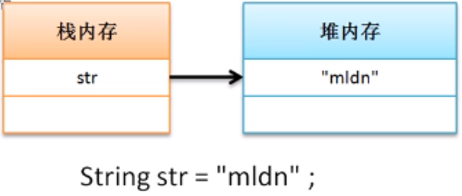
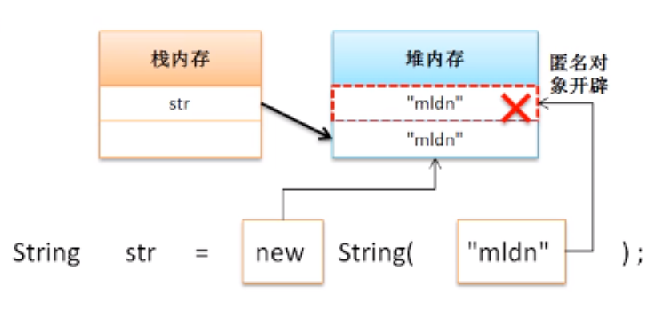
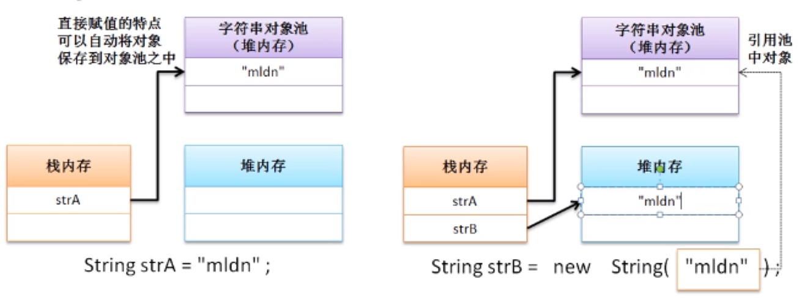
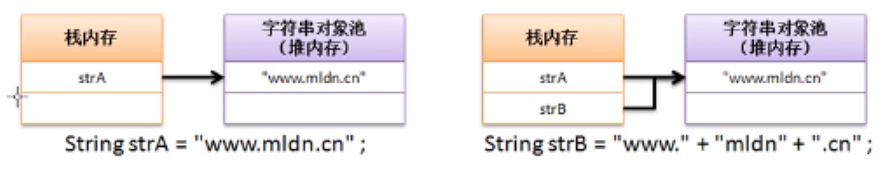
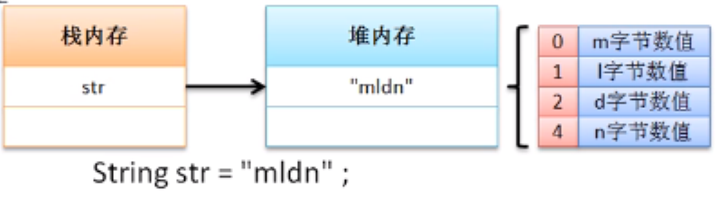
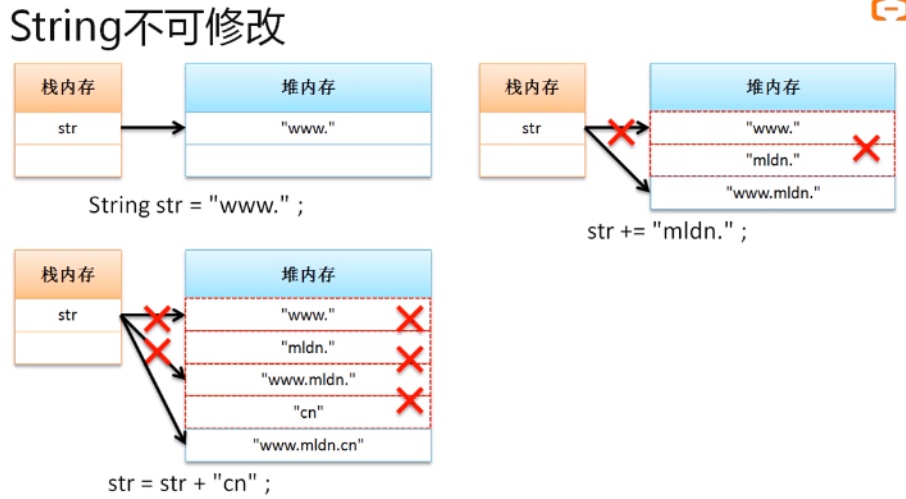

# String类特点分析

## **字符串比较**

String类相等的判断也可以使用“==”，但是判断的不准确

**范例：**实现字符串的相等判断                                                                                                                        

```java
public class StringDemo {
    public static void main(String args[]){
        String strA = "mldn";
        String strB = new String("mldn");
        System.out.println(strA==strB); // false
    }
}
```

此时的比较并没有成功，所以发现虽然两个字符串对象的内容相同，但是“==”没法得到准确的相等判断，这种情况下如果想实现准确的字符串相等判断，那么可以使用String类提供的比较方法：			   

- **字符串比较（有变形）：public boolean equals(String str)；**

**范例：**利用equals()实现字符串比较

```java
public class StringDemo {
    public static void main(String args[]){
        String strA = "mldn";
        String strB = new String("mldn");
        System.out.println(strA.equals(strB)); // true
    }
}
```

> **面试题：**请解释String比较中“==”与equals()区别？
>
> - “==”：进行的是数值比较，如果用于对象比较上比较的是两个内存的地址数值；
> - equals()是类所提供的一个比较方法，可以直接进行字符串内容的判断

## **字符串常量**

在程序开发中，任何一个整数都是int型，任何一个小数默认都是double，但是对于字符串而言，程序中不会提供有字符串这样的基本数据类型，可以提供的只是String类，**所以任何使用双引号定义的字符串常量实际上描述的都是一个String类的匿名对象。**

```java
String str = "mldn";
```



所谓的String类对象的直接赋值直接描述的是，将一个匿名对象设置一个具体的引用名字

**范例：**观察匿名对象的存在

```java
public class StringDemo {
    public static void main(String args[]){
        String str = "mldn";
        System.out.println("mldn".equals(str)); // true
    }
}
```

此时可以发现字符串常量可以明确调用equals（）方法实现对象相等的判断，因此可以得出结论：程序中没有字符串常量，有的只是String类的匿名对象

**关于对象相等判断的小技巧：**

- 如果某些数据由用户输入，并且要求这些数据为一个指定内容的情况下，建议将字符串的常量写在前面

接收用户输入数据的字符串调用方法：

```java
public class StringDemo {
    public static void main(String args[]){
        String input = null; // 用户输入的内容
        System.out.println(input.equals("mldn")); // true
    }
}//NullPointerException
```

将字符串的常量写在前面

```java
public class StringDemo {
    public static void main(String args[]){
        String input = null; // 用户输入的内容
        System.out.println("mldn".equals(input)); // false
    }
}
```

equal（）方法提供一个可以回避null的判断，所以如果将字符串的常量写在前面，那么调用equals（）方法时就不会出现“NullPointerException”。因为字符串是一个匿名对象，匿名对象一定是开辟好堆内存空间的对象。

## **String类对象两种实例化方式比较**

**1、分析直接赋值的对象实例化模式**

- 在程序中只需要将一个字符串赋值给String类的对象就可以实现对象实例化处理

```java
public class StringDemo {
    public static void main(String args[]){
        String str = "mldn";
    }
}
```

这种情况下只会开辟出一块堆内存空间，此时的内存关系图如下：


除了这种内存模式之外，利用直接赋值实例化String的形式还可以实现同一个字符串对象数据的共享操作

**范例：**观察String直接赋值时的数据共享

```java
public class StringDemo {
    public static void main(String args[]){
        String strA = "mldn";
        String strB = "mldn";
        System.out.println(strA == strB); // 地址判断 true
    }
}
```

此时程序返回结果“true”，因此这两个对象指向的堆内存是同一个，此时内存关系如图所示：


在java程序的底层提供了一个专门的字符串池（字符串数组）

**范例：**分析字符串池的概念

```java
public class StringDemo {
    public static void main(String args[]){
        String strA = "mldn";
        String strB = "mldnjava";
        String strC = "mldn";
        System.out.println(strA == strB); // 地址判断
    }
}
```

字符串池内存分析：


在采用直接赋值的处理过程之中，对于字符串而言可以实现池数据的自动保存，如果再有相同数据定义时，则可以减少对象的产生，以提升操作性能

**2、分析构造方法实例化**

构造方法进行对象实例化是进行对象定义的常见做法，String类为了满足设计的结构要求也提供了构造方法实例化的做法。

```java
public class StringDemo {
    public static void main(String args[]){
        String strA = new String("mldn");
    }
}
```

此时对于上述程序而言，可以通过内存关系图进行观察



此时会开辟两块堆内存空间，但我们只会使用一块。而另一个字符串常量所定义的匿名对象会成为垃圾空间。

**范例：**更换一种形式

```java
public class StringDemo {
    public static void main(String args[]){
        String strA = "mldn";
        String strB = new String("mldn");
    }
}
```

内存分析：



除了以上特点之外，在使用构造方法实例化String类对象时不会自动出现保存到字符串池的处理

**范例：**构造方法实例化对象时的池操作

```java
public class StringDemo {
    public static void main(String args[]){
        String strA = "mldn";
        String strB = new String("mldn");
        System.out.println(strA == strB); // false
    }
}
```

构造方法实例化的对象属于自己专用的内存空间，但是在String类中也存在帮助开发者实现手工入池的处理情况**public String intern();**

**范例：**观察手工入池

```java
public class StringDemo {
    public static void main(String args[]){
        String strA = "mldn";
        String strB = new String("mldn").intern();
        System.out.println(strA == strB); // true
    }
}
```

在使用构造方法定义对象由于使用了intern()方法，所以即便是构造出来的String类对象的内容也可以实现对象池的统一管理；

> **面试题：**请解释String类两种对象实例化方式的区别？
>
> - 直接赋值：只会产生一个实例化对象，并且可以保存到对象池中，以实现该字符串实例的重用
> - 构造方法：会产生两个实例化对象，并且不会自动入池，无法实现对象重用，但是可以通过intern()方法实现手工入池

## **String对象常量池**

对象池的主要目的是实现数据的共享处理，以String对象池为例，里面的内容就是为了重用，而重用实际上就属于共享设计，但在java中对象池（常量池）实际上可以分为两种：

- 静态常量池：指的是程序（*.class）加载时会自动将此程序中保存的字符串、普通的常量、类和方法的信息全部进行分配
- 运行时常量池：当一个程序（*.class）加载之后，里面可能有一些变量，这个时候提供的常量池称为运行时常量池

**范例**：观察一个程序（静态常量池）

```java
public class StringDemo {
    public static void main(String args[]){
        String strA = "www.mldn.cn";
        String strB = "www."+"mldn"+".cn";
        System.out.println(strA == strB); // true
    }
}
```

本程序中所给的内容都是常量数据（字符串的常量都是匿名对象），所以最终程序加载时会自动帮助开发者处理好相应的连接



**范例**：观察一个程序（运行时常量池）

```java
public class StringDemo {
    public static void main(String args[]){
        String info = "mldn";
        String strA = "www.mldn.cn";
        String strB = "www."+info+".cn";
        System.out.println(strA == strB); // false
    }
}
```

这时返回false，因为程序在加载时并不确定info是什么内容。因为在进行字符串连接时info采用的是变量，变量的内容是可以修改的，所以程序并不认为strB是最终结果

## **字符串修改分析**

在String类中包含的是一个数组，数组的最大缺点在于长度不可改变，当设置了字符串之后，会自动的进行一个数组空间的开辟，开辟的内容长度是固定的。



**范例：**观察一个程序

```java
public class StringDemo {
    public static void main(String args[]){
        String str = "www.";
        str += "mldn.";
        str = str + "cn";
        System.out.println(str); // false
    }
}
```

本程序所进行的内存操作：



通过此时的内存分析发现，在整个处理过程中，字符串常量的内容没有发生任何的改变，改变的只是一个String类对象的引用，并且这种改变有可能带来大量的垃圾空间

**范例：**观察另外一种程序

```java
public class StringDemo {
    public static void main(String args[]){
        String str = "www.";
        for (int x = 0; x < 1000 ; x++){
            str += x;
        }
        System.out.println(str); // false
    }
}
```

上述程序会产生1000多个垃圾空间，并且String对象的指向要修改1000次，这样程序的性能非常差，String类在以后的开发中不用进行内容的频繁修改

## **主方法组成分析**

Java中的主方法组成复杂，**public static void main(String args[]):**

- public：描述的是访问权限，主方法是一切的开始点，开始点一定是公共的
- static：程序的执行是通过类名称完成的，此方法是通过类直接调用
- void：主方法是一切的起点，起点一旦开始就没有返回的可能
- main：是一个系统定义好的方法名称
- String args[]：字符串的数组，可以实现程序驱动参数的接收

**范例：**输出启动参数

```java
public class StringDemo {
    public static void main(String args[]){
        for (String arg:args){
            System.out.println(arg);
        }
    }
}
```

在程序执行的时候可以设置参数，每一个参数之间使用空格分隔：

**java StringDemo first second**

如果你的参数本身拥有空格，则必须使用双引号包装：

**java StringDemo “hello world” “hello mldn”**

