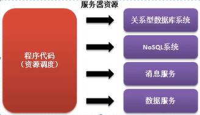

# Annotation注解

## **Annotation简介**

Annotation是从JDK1.5提出的一个新的开发技术结构，利用Annotion可以有效的减少程序配置的代码，并且可以利用Annotation进行结构化的定义。Annotation是以一种注解的形式实现的程序开发。

程序的开发一共分为了三个过程：

**过程一：**在程序定义的时候将所有可能使用到的资源全部定义到程序代码中

- 如果此时服务器的相关地址发生改变，则需要进行源代码的修改，维护需要由开发人员完成

**过程二：**引入配置文件，在配置文件中定义全部要使用的服务器资源

- 在配置项不多的情况下，此类配置非常好用，并且十分简单，但是如果所有的项目都采用这种结构开发，就会出现配置文件暴多；
- 所有的操作都需要通过配置文件完成，这对于开发的难度提升了；-1623136116998.png)

**过程三：**将配置信息重新写会程序中，利用一些特殊的标记与程序代码进行分离，这就是注解的作用，也就是Annotation提出的基本依据

- 如果全部使用注解开发，难度太高，所以现在开发是围绕配置文件和注解的形式完成的

## **准确覆写：@Override**

当子类继承父类之后，如果发现父类中某些方法功能不足时会采用覆写的形式对方法功能进行扩充

**范例：**观察覆写问题

```java
class Channel{ //
    public void connect(){
        System.out.println("****** channel *******");
    }
}

class DatabaseChannel extends Channel{
    public void connection(){
        System.out.println("子类定义的通道连接操作");
    }
}

public class JavaDemo{
    public static void main(String args[]){
        new DatabaseChannel().connect();
    }
}
```

开发中经常会出现两个问题：

- 继承覆写过程中忘记编写extends
- 在进行方法覆写时单词写错

此时即便单词写错了，程序编译时也不会出现任何错误信息，因为它认为这是一个新的方法。所以在开发中为了避免这种问题的出现，可以在明确覆写的方法上追加一个注解。

**范例：**追加注解

```java
class Channel{ //
    public void connect(){
        System.out.println("****** channel *******");
    }
}

class DatabaseChannel extends Channel{
    @Override  //明确表示该方法是一个覆写方法
    public void connect(){
        System.out.println("子类定义的通道连接操作");
    }
}

public class JavaDemo{
    public static void main(String args[]){
        new DatabaseChannel().connect(); // 子类定义的通道连接操作
    }
}
```

该方法主要帮助开发者在程序编译时检查出程序的错误

## **过期声明：@Deprecated**

过期操作指的是在一个软件项目迭代开发过程中，可能某一个方法或者是某个类，在最初设计的时候考虑不周，导致新版本的应用会有不适应的地方，这个时候又无法直接删除这些操作，此时希望给一个过渡的时间，于是就可以采用过期的声明，目的是告诉新的用户这些操作不要再用了。

**范例：**声明过期操作

```java
class Channel{ //
    @Deprecated   // 老系统继续使用，新的不要用了
    public void connect(){
        System.out.println("****** channel *******");
    }

    public String connection(){
        return "lalala";
    }
}

public class JavaDemo{
    public static void main(String args[]){
        new Channel().connect();
    }
}
```

## **压制警告：@SuppressWarnings**

```java
class Channel{ //
    @Deprecated   // 老系统继续使用，新的不要用了
    public void connect(){
        System.out.println("****** channel *******");
    }

    public String connection(){
        return "lalala";
    }
}

public class JavaDemo{
    @SuppressWarnings({"deprecation"})
    public static void main(String args[]){
        new Channel().connect();
    }
}
```

它做的只是让警告信息不出现

