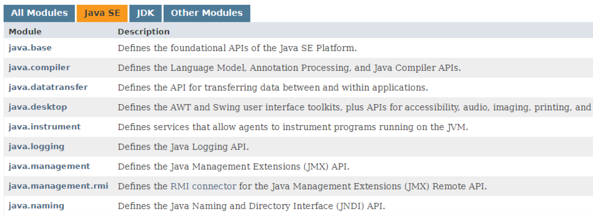
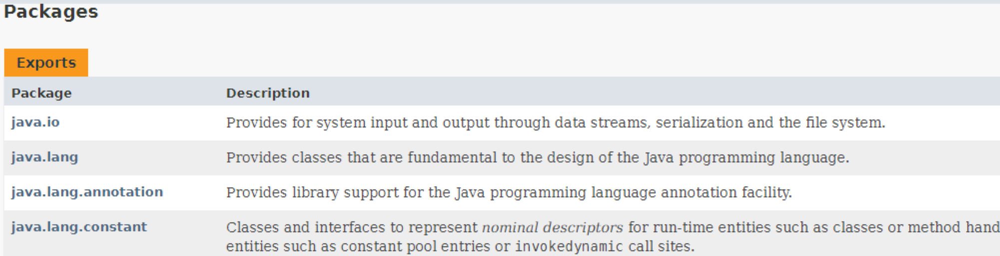
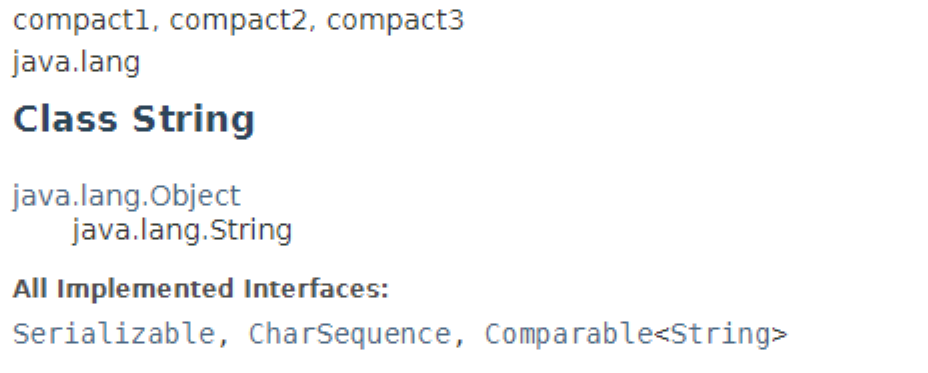
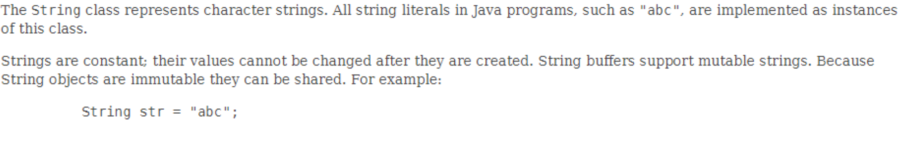
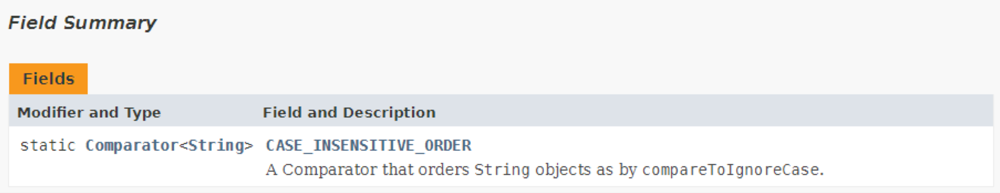
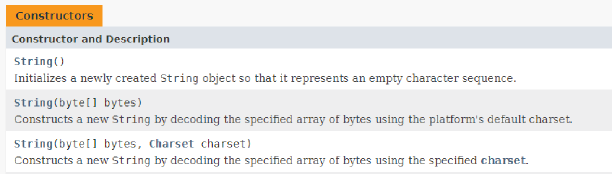
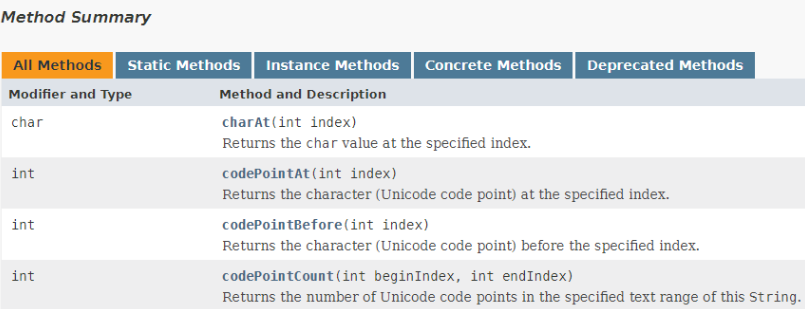
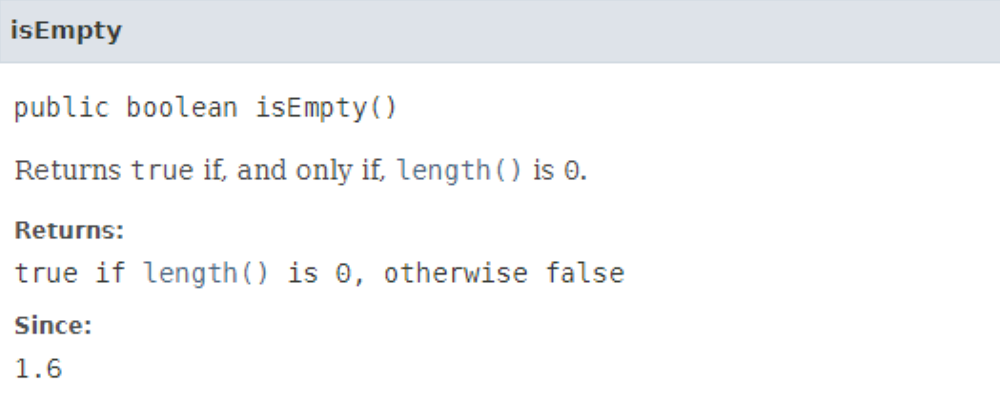

# String类常用方法

## **JavaDoc文档简介**

在以后开发过程中会大量使用Java的API文档（JavaDoc）,这个文档可以直接通过oracle的在线访问进行查看。https://docs.oracle.com/javase/8/docs/api/index.html

在jdk1.9之前，所有的java中的常用类库都会在JVM启动的时候进行全部加载，这样性能会有所下降，所以在jdk1.9开始提供有模块化的设计，将一些程序类放在不同的模块里



在模块中会包含大量的程序开发包：



如果想要看String类的相关定义，则可以查看java.lang这个包。String是系统提供的较为标准的类，现在以这个类的文档结构进行说明，一般文档里的组成会有如下几个部分：

- 类的完整定义：
- 类相关说明信息：

- 成员属性摘要：

- 构造方法摘要：如果看见”Deprecated“描述的方法表示不建议使用

- 方法摘要：左边为返回值，右边为方法名称和相应的参数

- 详细的说明：

文档一般都会有一些“假”的中文翻译版，这些翻译版最好别用

## **字符串与字符数组**

> 方法名称|类型|描述
>
> public String(char[] value)|构造方法|将传入的全部字符数组变为字符串
>
> public String(char[] value,int offset,int count)|构造方法|将部分字符数组变为字符串
>
> public char charAt(int index)|普通方法|获取指定索引位置的字符
>
> public char[] to CharArray()|普通方法|将字符串中的数据以字符数组的形式返回

**范例：**观察charAt()方法

```java
public class StringDemo {
    public static void main(String args[]){
        String str = "www.mldn.cn";
        char c = str.charAt(5);
        System.out.println(c); // l
        }
}
```

利用charAt()可以获取某一个指定索引位置的字符，但是程序中的索引下标都是从0开始的。

**范例：**实现字符串与字符数组的转化

```java
public class StringDemo {
    public static void main(String args[]){
        String str = "helloworld";
        char[] result = str.toCharArray(); // 将字符串变为字符数组
        for (int x= 0;x < result.length;x++){
            result[x] -= 32;
        }
        // 将处理后的字符数组交给String变为字符串
        String newstr = new String(result);
        System.out.println(newstr);  //HELLOWORLD
        System.out.println(new String(result,0,5)); //HELLO
    }
}
```

现在需要做一个验证功能，判断某一个字符串中的数据是否全部由数字所组成。此时可以采用如下思路

- 如果想要判断字符串中的每一位最好的方式是将字符串变为字符数组；
- 可以判断每一个字符是否在数字的范围之内（’0‘~’9‘）；
- 如果有一位不是数字则表示验证失败

**范例：**实现字符串的数据检查

```java
public class StringDemo {
    public static void main(String args[]){
        String str = "helloworld";
        System.out.println(isNumber(str)? "由数字所组成":"不是由数字所组成"); // 不是由数组所组成
        System.out.println(isNumber("123")? "由数字所组成":"不是由数字所组成");// 由数组所组成
    }
    // 该方法主要是判断字符是否由数字所组成
    public static boolean isNumber(String str){
        char[] result = str.toCharArray();
        for (int x = 0;x < result.length; x++){
            if (result[x] < '0' || result[x] > '9'){
                return false;
            }
        }
        return true;
    }
}
```

## **字符串与字节数组**

当进行字符串与字节转换时，其主要目的是为了进行二进制的数据传输，或者是进行编码转换

> 方法名称|类型|描述
>
> public String(byte[] bytes)|构造方法|将传入的全部字节数组变为字符串
>
> public String(byte[] bytes,int offset,int length)|构造方法|将部分字节数组变为字符串
>
> public byte[] getBytes()|普通方法|将字符串转为字节数组
>
> public byte[] getBytes(String charsetName) throws UnsupportedEncodingException|普通方法|编码转换

**范例：**观察字节与字符串的转换

```java
public class StringDemo {
    public static void main(String args[]){
        String str = "helloworld";
        byte data[] = str.getBytes(); // 将字符串变为字节数组
        for (int x = 0; x < data.length; x++){
            data[x] -= 32;
        }
        System.out.println(new String(data));
        System.out.println(new String(data,0,5));
    }
}
```

字节本身有长度限制，一个字节最多可以保存的范围是：-128~127

## **字符串比较**

字符串比较中最为常用的方法就是equals()，但是这个方法需要注意的是其会进行大小写区分，而除了equals()之外还有其他比较方法

**范例：**观察大小写比较

```java
public class StringDemo {
    public static void main(String args[]){
        String strA = "mldn";
        String strB = "MLDN";
        System.out.println(strA.equals(strB)); // false
    }
}
```

> 方法名称|类型|描述
>
> public int compareTo([String](https://docs.oracle.com/javase/8/docs/api/java/lang/String.html) anotherString)|普通方法|进行字符串大小比较，该方法返回一个int数据，该数据有三种取值：大于（>0）、小于（<0）、等于（=0）
>
> public int compareToIgnoreCase([String](https://docs.oracle.com/javase/8/docs/api/java/lang/String.html) str)|普通方法|不区分大小写进行字符串大小比较
>
> public boolean equals(String anObject)|普通方法|区分大小写的相等判断
>
> public boolean equalsIgnoreCase([String](https://docs.oracle.com/javase/8/docs/api/java/lang/String.html) anotherString)|普通方法|不区分大小写比较

**范例：**不区分大小写比较

```java
public class StringDemo {
    public static void main(String args[]){
        String strA = "mldn";
        String strB = "MLDN";
        System.out.println(strA.equalsIgnoreCase(strB)); // true
    }
}
```

**范例：**进行字符串大小比较

```java
public class StringDemo {
    public static void main(String args[]){
        String strA = "m";
        String strB = "M";
        System.out.println(strA.compareTo(strB)); // 'm'- 'M' 32
        System.out.println(strB.compareTo(strA)); // -32
        System.out.println("hello".compareTo("hello")); //0
    }
}
```

compareTo()这个方法很重要，为了实现忽略大小写的比较也可以使用compareToIgnoreCase()方法实现

**范例：**忽略大小写的比较

```java
public class StringDemo {
    public static void main(String args[]){
        String strA = "mldn";
        String strB = "MLDN";
        System.out.println(strA.compareToIgnoreCase(strB)); //0
    }
}
```

## **字符串查找**

从一个完整的字符串中查找子字符串的存在就属于字符串查找操作，在String类里一共提供有如下几个查找方法：

> 方法名称|类型|描述
>
> public boolean contains(String s)|普通方法|判断子字符串是否存在
>
> public int indexOf(int ch)|普通方法|从头查找指定字符串的位置，找不到返回-1
>
> public int indexOf([String](https://docs.oracle.com/javase/8/docs/api/java/lang/String.html) str,int fromIndex)|普通方法|从指定位置查找指定字符串的位置
>
> public int lastIndexOf([String](https://docs.oracle.com/javase/8/docs/api/java/lang/String.html) str)|普通方法|由后向前查找指定字符串的位置
>
> public int lastIndexOf([String](https://docs.oracle.com/javase/8/docs/api/java/lang/String.html) str,int fromIndex)|普通方法|从指定位置由后向前查找指定字符串的位置
>
> public boolean startsWith([String](https://docs.oracle.com/javase/8/docs/api/java/lang/String.html) prefix)|普通方法|判断是否以指定字符串开头
>
> public boolean startsWith([String](https://docs.oracle.com/javase/8/docs/api/java/lang/String.html) prefix,int toffset)|普通方法|由指定位置判断是否以指定字符串开头
>
> public boolean endsWith([String](https://docs.oracle.com/javase/8/docs/api/java/lang/String.html) suffix)|普通方法|判断是否以指定字符串结尾

**范例：**判断子字符串是否存在

```java
public class StringDemo {
    public static void main(String args[]){
        String strA = "mldn";
        System.out.println(strA.contains("mldn")); // true
        System.out.println(strA.contains("hello")); //false
    }
}
```

contains方法是从jdk1.5之后追加到程序中的功能，在jdk1.5之前想要进行数据的查询往往只能依靠indexOf()方法完成

**范例：**判断字符串是否存在

```java
public class StringDemo {
    public static void main(String args[]){
        String str = "www.mldn.cn";
        System.out.println(str.indexOf("mldn")); // 4
        System.out.println(str.indexOf("hello")); //-1 没有查到
        if (str.indexOf("mldn") != -1){
            System.out.println("数据存在");
        }
    }
}
```

indexOf()是为了进行子字符串位置的查询，在一些开发中就可以利用此方法进行索引的确定。indexOf()是右前向后进行查找的，也可以由后向前查找。

**范例：**使用lastIndexOf()查找

```java
public class StringDemo {
    public static void main(String args[]){
        String str = "**@@www.mldn.cn##";
        System.out.println(str.startsWith("**")); // true
        System.out.println(str.startsWith("@@",2)); // true
        System.out.println(str.endsWith("##")); // true
    }
}
```

## **字符串替换**

所谓的字符串替换指的是可以通过一个指定内容进行执行字符串的替换显示，对于替换方法主要有两个

> 方法名称|类型|描述
>
> public [String](https://docs.oracle.com/javase/8/docs/api/java/lang/String.html) replaceAll([String](https://docs.oracle.com/javase/8/docs/api/java/lang/String.html) regex,[String](https://docs.oracle.com/javase/8/docs/api/java/lang/String.html) replacement)|普通方法|全部替换
>
> public [String](https://docs.oracle.com/javase/8/docs/api/java/lang/String.html) replaceFirst([String](https://docs.oracle.com/javase/8/docs/api/java/lang/String.html) regex,[String](https://docs.oracle.com/javase/8/docs/api/java/lang/String.html) replacement)|普通方法|替换首个

**范例：**实现替换

```java
public class StringDemo {
    public static void main(String args[]){
        String str = "helloworld";
        System.out.println(str.replaceAll("l","x")); // hexxoworxd
        System.out.println(str.replaceFirst("l","x")); // hexloworld
    }
}
```

## **字符串拆分**

在字符串处理时还提供了一种字符串拆分的处理方式，字符串的拆分操作主要可以根据一个指定的字符串或者是一些表达式实现字符串的拆分，并且拆分完成的数据将以字符串数组的形式返回

> 方法名称|类型|描述
>
> public [String](https://docs.oracle.com/javase/8/docs/api/java/lang/String.html)[] split([String](https://docs.oracle.com/javase/8/docs/api/java/lang/String.html) regex)|普通方法|按照指定的字符串全部拆分
>
> public [String](https://docs.oracle.com/javase/8/docs/api/java/lang/String.html)[] split([String](https://docs.oracle.com/javase/8/docs/api/java/lang/String.html) regex,int limit)|普通方法|按照指定字符串拆分为指定个数，后面不拆了

**范例：**观察字符串拆分处理

```java
public class StringDemo {
    public static void main(String args[]){
        String str = "hello world hello mldn";
        String result[] = str.split(" ");  // 按空格拆分
        for (int x= 0 ; x < result.length; x++){
            System.out.println(result[x]);
        }
    }
}
```

除了可以全部拆分之外，也可以拆分为指定的个数

**范例：**拆分指定个数

```java
public class StringDemo {
    public static void main(String args[]){
        String str = "hello world hello mldn";
        String result[] = str.split(" ",2);  // 按空格拆分
        for (int x= 0 ; x < result.length; x++){
            System.out.println(result[x]);
        }
    }
}
```

在拆分的时候有可能会遇见拆不了的情况，这个时候最简单的理解就是使用“\\\\”进行转义

```java
public class StringDemo {
    public static void main(String args[]){
        String str = "192.168.1.2";
        String result[] = str.split("\\.",2);  
        for (int x= 0 ; x < result.length; x++){
            System.out.println(result[x]);
        }
    }
}
```

## **字符串截取**

从一个完整的字符串中截取出子字符串，对于截取操作主要有两个方法：

> 方法名称|类型|描述
>
> public [String](https://docs.oracle.com/javase/8/docs/api/java/lang/String.html) substring(int beginIndex)|普通方法|从指定索引截取到结尾
>
> public [String](https://docs.oracle.com/javase/8/docs/api/java/lang/String.html) substring(int beginIndex,int endIndex)|普通方法|截取指定索引范围中的子字符串

**范例：**观察截取字符串

```java
public class StringDemo {
    public static void main(String args[]){
        String str = "www.mldn.cn";
        System.out.println(str.substring(4)); // mldn.cn
        System.out.println(str.substring(4,8)); // mldn
    }
}
```

在实际的开发中，开始或结束索引往往都是通过indexOf()计算得来的

**范例：**观察截取

```java
public class StringDemo {
    public static void main(String args[]){
        String str = "mldn-photo-张三.jpg";
        int beginIndex = str.indexOf("-",str.indexOf("photo"));
        int endIndex = str.lastIndexOf(".");
        System.out.println(str.substring(beginIndex+1,endIndex));
    }
}
```

## **字符串格式化**

从jdk1.5开始为了吸引更多的传统开发人员，Java提供了格式化数据处理操作，可以利用占位符实现数据的输出。对于占位符，常用的：字符串（%s）、字符（%c）、整数（%d）、小数（%f）

> 方法名称|类型|描述
>
> public static [String](https://docs.oracle.com/javase/8/docs/api/java/lang/String.html) format([String](https://docs.oracle.com/javase/8/docs/api/java/lang/String.html) format,[Object](https://docs.oracle.com/javase/8/docs/api/java/lang/Object.html)... args)|普通方法|根据指定结构进行文本格式化显示
>
> public [String](https://docs.oracle.com/javase/8/docs/api/java/lang/String.html) substring(int beginIndex,int endIndex)|普通方法|截取指定索引范围中的子字符串

**范例：**观察格式化处理

```java
public class StringDemo {
    public static void main(String args[]){
        String name = "张三";
        int age = 18;
        double score = 98.7563;
        String str = String.format("姓名：%s、年龄：%d、成绩：%5.2f",name,age,score);
        System.out.println(str); // 姓名：张三、年龄：18、成绩：98.76
    }
}
```

## **其他操作方法**

在String类中还有一些方法：

> 方法名称|类型|描述
>
> public [String](https://docs.oracle.com/javase/8/docs/api/java/lang/String.html) concat([String](https://docs.oracle.com/javase/8/docs/api/java/lang/String.html) str)|普通方法|描述的是字符串的连接
>
> public [String](https://docs.oracle.com/javase/8/docs/api/java/lang/String.html) intern()|普通方法|字符串入池
>
> public boolean isEmpty()|普通方法|判断是否为空字符串(不是null)
>
> public int length()|普通方法|计算字符串长度
>
> public [String](https://docs.oracle.com/javase/8/docs/api/java/lang/String.html) trim()|普通方法|去除左右的空格信息
>
> public [String](https://docs.oracle.com/javase/8/docs/api/java/lang/String.html) toUpperCase()|普通方法|转大写
>
> public [String](https://docs.oracle.com/javase/8/docs/api/java/lang/String.html) toLowerCase()|普通方法|转小写

**范例：**观察字符串连接

```java
public class StringDemo {
    public static void main(String args[]){
        String strA = "www.mldn.cn";
        String strB = "www.".concat("mldn").concat(".cn");
        System.out.println(strB);
        System.out.println(strA==strB); //false
    }
}
```

从整体的运行结果来看，虽然内容相同，但是最终的结果是false，证明此操作并没实现静态的定义。

**在字符串定义时“”和null不是一个概念，一个表示有实例化对象，另一个表示没有实例化对象，而isEmpty()方法判断字符串的内容，一定要在有实例化对象的时候进行调用**

**范例：**判断空字符串

```java
public class StringDemo {
    public static void main(String args[]){
        String str = "";
        System.out.println(str.isEmpty()); // true
        System.out.println("mldn".isEmpty()); //false
    }
}
```

**范例：**观察length和trim

```java
public class StringDemo {
    public static void main(String args[]){
        String str = "  hello world ";
        System.out.println(str.length());//14
        String trimStr = str.trim();
        System.out.println(trimStr.length());//11
    }
}
```

在String类中提供有大小写转换，但是这种转换的特征是可以避免非字母的转换

**范例：**观察大小写转换

```java
public class StringDemo {
    public static void main(String args[]){
        String str = "hello world!!! ";
        System.out.println(str.toUpperCase());  // HELLO WORLD!!! 
        System.out.println(str.toLowerCase()); // hello world!!! 
    }
}
```

虽然在java中的String类已经提供了大量的方法，但是缺少了一个首字母大写的方法，这个方法可以由开发者自定义实现

**范例：**自定义实现一个首字母大写的方法

```java
class StringUtil{
    public static String initcap(String str){
        if (str == null || "".equals(str)){
            return str;  // 原样返回
        }
        if (str.length() == 1){
            return str.toUpperCase();
        }
        return str.substring(0,1).toUpperCase() + str.substring(1) ;
    }
}
public class StringDemo {
    public static void main(String args[]){
        System.out.println(StringUtil.initcap("hello"));
        System.out.println(StringUtil.initcap("m"));
    }
}
```

