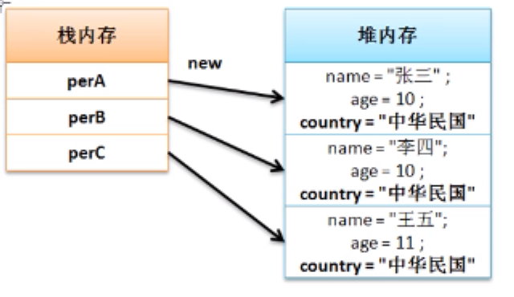
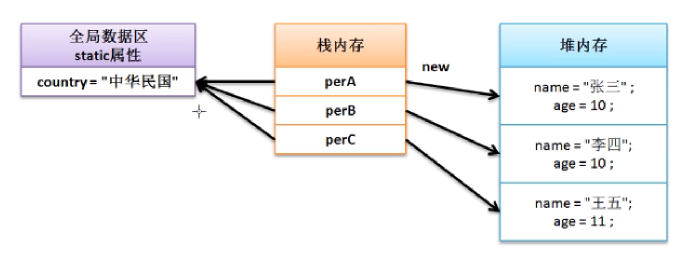

# static关键字

static是一个关键字，这个关键字主要可以用来定义属性和方法。在一个类之中，所有的属性一旦定义了实际上内容都交由各自的堆内存空间所保存。声明static属性

# 声明static属性

**范例：**定义一个程序类

```java
class Person{  // 创建所有同一个国家的类
    private String name;
    private int age;
    String country = "中华民国";  //暂时不封装
    public Person(String name,int age){
        this.name = name;
        this.age = age;
    }
    // setter、getter略
    public String getInfo(){
        return  "姓名：" + this.name + "、年龄：" + this.age + "、国家："+ this.country;
    }
}

public class JavaDemo {
    public static void main(String args[]){
        Person perA = new Person("张三",10);
        Person perB = new Person("李四",10);
        Person perC = new Person("王五",11);
        System.out.println(perA.getInfo());
        System.out.println(perB.getInfo());
        System.out.println(perC.getInfo());
    }
}
```

为了更好的观察程序的问题，对上述代码进行内存分析：static内存分析



如果country改变了，并且你已经产生了5000w个对象，但是由于每一个对象都拥有各自的country属性，所以这时从整体设计上看出现了问题（重复保存数据、并且修改不方便）

那么此时最好的解决方案是将country修改为公共属性，这种情况下需要使用static进行标注

**范例：**修改Person类定义，使用static定义公共属性

```java
class Person{  // 创建所有同一个国家的类
    private String name;
    private int age;
    static String country = "中华民国";  //暂时不封装
    public Person(String name,int age){
        this.name = name;
        this.age = age;
    }
    // setter、getter略
    public String getInfo(){
        return  "姓名：" + this.name + "、年龄：" + this.age + "、国家："+ this.country;
    }
}

public class JavaDemo {
    public static void main(String args[]){
        Person perA = new Person("张三",10);
        Person perB = new Person("李四",10);
        Person perC = new Person("王五",11);
        perA.country = "中华人民共和国";
        System.out.println(perA.getInfo());
        System.out.println(perB.getInfo());
        System.out.println(perC.getInfo());
    }
}
```

> 输出： 只修改了一个对象的属性内容，全局对象都发生改变
>
> 姓名：张三、年龄：10、国家：中华人民共和国
>
> 姓名：李四、年龄：10、国家：中华人民共和国
>
> 姓名：王五、年龄：11、国家：中华人民共和国

此时发现所有对象中的country属性的内容都发生改变，所以这是一个公共属性，此时的内存关系图如下：



对于static属性的访问需要注意：由于其本身是一个公共属性，虽然可以通过对象进行访问，但是最好是通过所有对象的最高代表（类）来进行访问，<font color='red'>所以static属性可以由类名称直接调用</font>

```java
Person.country = "中华人民共和国";
```

> static属性虽然定义在类之中，但是其并不受到类实例化对象的控制。static属性可以在没有实例化对象的时候使用

**范例：**不产生实例化对象调用static属性

```java
class Person{  // 创建所有同一个国家的类
    private String name;
    private int age;
    static String country = "中华民国";  //暂时不封装
    public Person(String name,int age){
        this.name = name;
        this.age = age;
    }
    // setter、getter略
    public String getInfo(){
        return  "姓名：" + this.name + "、年龄：" + this.age + "、国家："+ this.country;
    }
}

public class JavaDemo {
    public static void main(String args[]){
        System.out.println(Person.country);
        Person.country = "中华人民共和国";
        Person per = new Person("zhangsan",10);
        System.out.println(per.getInfo());
    }
}
```

总结：在以后进行类设计时，首选的一定是非static属性，而考虑到公共信息存储时才会使用static属性，<font color='red'>非static属性必须在实例化对象产生之后才可以使用，而static属性可以在没有实例化对象产生的情况下直接通过类名称进行调用</font>

