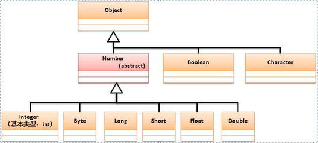

# 包装类

包装类的主要功能是针对基本数据类型的对象转换而实现的。

## **包装类实现原理分析**

Object类最大的特点是所有类的父类，并且可以接收所有的数据类型，但是基本数据类型并不是一个类，所以如果想将基本数据类型以类的形式进行处理，就需要对其进行包装。

**范例：**以int数据为例实现包装处理的定义

```java
class Int{
    private int data;  // 包装了一个基本数据类型
    public Int(int data){
        this.data = data;
    }
    public int intValue(){
        return this.data;
    }
}

public class JavaDemo{
    public static void main(String args[]){
        Object obj = new Int(10);  //  向上转型 装箱：将基本数据类型保存在包装类之中
        int x = ((Int)obj).intValue(); // 拆箱：从包装类对象中获取基本数据类型
        System.out.println( x * 2);
    }
}
```

基本数据类型进行包装处理后可以像对象那样进行引用传递，同时也可以使用Object类进行接收。在jdk1.0后就提出了包装类的概念，基本数据类型一共有八种，所以提供有八种包装类：



可以发现Java中包装类一共提供有两种类型：

- 对象型包装类（Object直接子类）：Boolean、Character
- 数值型的包装类：Byte、Long、Short、Float、Double、Integer

Number是一个抽象类，这个类定义有如下方法：

1. public byte byteValue()    普通   从包装类中获取byte数据
2. public short shortValue()  普通   从包装类中获取Short数据
3. public abstract int intValue()  普通  从包装类中获取int数据
4. public abstract long longValue()  普通   从包装类中获取long数据
5. public abstract float floatValue()  普通   从包装类中获取float数据
6. public abstract double doubleValue()  普通   从包装类中获取double数据

Number类中就直接提供有获取包装类中基本数据类型的功能，一共只定义有六个方法

## **装箱与拆箱**

基本数据类型的包装类都是为了基本数据类型转为对象提供的，对于基本类型与包装类之间就有了如下的操作关系：

- 数据装箱：将基本数据类型保存到包装类中，一般可以利用构造方法完成

- - Integer类：public Integer(int value);
  - Double类：public Double(double value);
  - Boolean类：public Boolean(boolean value);

- 数据拆箱：从包装类中获取基本数据数据类型

- - 数值型包装类已经由Number类定义了拆箱的方法了
  - Boolean型：public boolean booleanValue()；

**范例：**以int和Integer为例

```java
public class JavaDemo{
    public static void main(String args[]){
        Integer obj = new Integer(10);  // 装箱：将基本数据类型保存在包装类之中
        int num = obj.intValue(); // 拆箱：从包装类对象中获取基本数据类型
        System.out.println( num * 2);
    }
}
```

**范例：**以double与Double为例

```java
public class JavaDemo{
    public static void main(String args[]){
        Double obj = new Double(10.1);  // 装箱：将基本数据类型保存在包装类之中
        double num = obj.doubleValue(); // 拆箱：从包装类对象中获取基本数据类型
        System.out.println( num * num);
    }
}
```

**范例：**以boolean与Boolean为例

```java
public class JavaDemo{
    public static void main(String args[]){
        Boolean obj = new Boolean(true);  // 装箱：将基本数据类型保存在包装类之中
        boolean num = obj.booleanValue(); // 拆箱：从包装类对象中获取基本数据类型
        System.out.println(num);
    }
}
```

从jdk1.9之后，对于所有包装类中提供的构造方法就变为了过期处理，不建议用户再继续使用，这是因为从jdk1.5之后为了方便处理提供了自动的装箱与拆箱操作，所以这种手工的方式基本没人用了。

**范例：**观察自动装箱与拆箱

```java
public class JavaDemo{
    public static void main(String args[]){
        Integer obj = 10; //自动装箱，此时不用关心构造方法
        int num = obj; // 自动拆箱
        obj ++;  // 包装类对象可以直接参与数学运算
        System.out.println(num * obj);
    }
}
```

除了提供这种自动的数学运算支持之外，使用自动装箱最大的好处是可以实现Object接收基本数据类型的操作。

**范例：**Object接收double

```java
public class JavaDemo{
    public static void main(String args[]){
        Object obj = 19.2;  // double自动装箱为Double，向上转型为Object
        double num = (Double) obj; // 向下转型为包装类，再自动拆箱
        System.out.println(num * 2); // 38.4
    }
}
```

但是对于包装类需要注意一些问题，关于相等判断上：进行包装类相等判断时一定要使用equals()完成，而包装类本身也需要考虑占位的长度，如果超过了一位的内容，就需要equals()比较，如果不超过使用“==”即可判断

**范例：**观察相等判断

```java
public class JavaDemo{
    public static void main(String args[]){
        Integer x = 128;
        Integer y = 128;
        System.out.println(x == y); // false
        System.out.println(x.equals(y)); // true
    }
}
```

