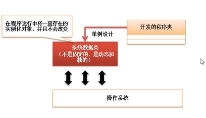

# 单例与多例设计模式

## **单例设计模式**

单例设计模式（多例设计模式）主要是一种控制实例化对象产生个数的设计操作。

```java
class Singleton{
    public void print(){
        System.out.println("www.mldn.cn");
    }
}
public class JavaDemo {
    public static void main(String args[]) {
        Singleton instanceA = new Singleton();
        Singleton instanceB = new Singleton();
        Singleton instanceC=  new Singleton();
        instanceA.print();
        instanceB.print();
        instanceC.print();
    }
}
```

由于某些要求，现在只允许Singleton类提供一个实例化对象，那么首先应该控制的是构造方法。因为所有的实例化对象产生一定会调用构造方法，如果构造方法没有了，自然无法产生实例化对象。

**范例：**构造方法私有化

```java
class Singleton{
    private Singleton(){}  // 构造方法私有化
    public void print(){
        System.out.println("www.mldn.cn");
    }
}
```

此时产生实例化对象：

1. private访问权限的主要特点在于：不能在类外部访问，但是可以在类本身调用，所有可以考虑在类内部调用构造

```java
class Singleton{
    private Singleton instance = new Singleton();  
    private Singleton(){}// 构造方法私有化
    public void print(){
        System.out.println("www.mldn.cn");
    }
}
```

2. 此时instance是一个普通属性，而普通属性是在有实例化对象产生之后才会被调用的，但是此时外部无法产生实例化对象，所以这个属性无法被访问，那么就必须考虑没有实例化对象时获取该属性，可以通过static关键字。

```java
class Singleton{
    static Singleton instance = new Singleton();  
    private Singleton(){}// 构造方法私有化
    public void print(){
        System.out.println("www.mldn.cn");
    }
}
public class JavaDemo {
    public static void main(String args[]) {
        Singleton.instance.print();
    }
}
```

3. 类中的属性应该封装后使用，所以需要将instance封装起来，，那么就需要通过一个static方法获得

```java
class Singleton{
    private static Singleton instance = new Singleton();  
    private Singleton(){}// 构造方法私有化
    public static Singleton getInstance(){
        return instance;
    }
    public void print(){
        System.out.println("www.mldn.cn");
    }
}
public class JavaDemo {
    public static void main(String args[]) {
        Singleton.getInstance().print();
    }
}
```

4. 此时虽然提供了static的实例化对象，但是这个对象依然可以被重新实例化，所以需要保证Singleton类内部的instance无法再次实例化：使用final关键字

```java
class Singleton{
    private static final Singleton INSTANCE = new Singleton();  
    private Singleton(){}// 构造方法私有化
    public static Singleton getInstance(){
        return INSTANCE;
    }
    public void print(){
        System.out.println("www.mldn.cn");
    }
}
public class JavaDemo {
    public static void main(String args[]) {
        Singleton.getInstance().print();
    }
}
```

有些类是不需要重复产生对象的



饿汉式：在系统加载类的时候会自动提供Singleton的实例化对象。懒汉式：在第一次使用的时候进行实例化对象处理

**范例：**将单例修改为懒汉式

```java
class Singleton{
    private static Singleton instance;
    private Singleton(){}// 构造方法私有化
    public static Singleton getInstance(){
        if (instance == null){ // 第一次使用
            instance = new Singleton();
        }
        return instance;
    }
    public void print(){
        System.out.println("www.mldn.cn");
    }
}
public class JavaDemo {
    public static void main(String args[]) {
        Singleton.getInstance().print();
    }
}
```

## **多例设计**

可以保留多个实例化对象

**范例：**实现多例设计

```java
class Color{  // 定义描述颜色的类
    private static final Color RED = new Color("红色");
    private static final Color GREEN = new Color("绿色");
    private static final Color BLUE = new Color("蓝色");
    private String title;
    private Color(String title){ // 构造方法私有化
        this.title = title;
    }
    public static Color getInstance(String color){
        switch (color){
            case "red":return RED;
            case "green":return GREEN;
            case "blue":return BLUE;
            default:return null;
        }
    }
    public String toString(){
        return this.title;
    }

}
public class JavaDemo {
    public static void main(String args[]) {
        Color c = Color.getInstance("green");
        System.out.println(c);
    }
}
```

