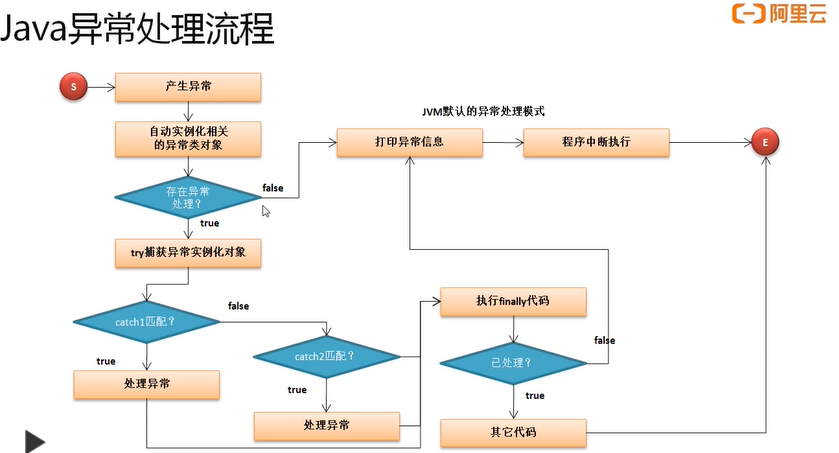

# 异常处理

## **认识异常对程序的影响**

**范例：**没有异常产生

```java
public class JavaDemo {
    public static void main(String args[]) {
        System.out.println("【1】*******程序开始执行*********");
        System.out.println("【2】*******数学计算："+(10 / 2));
        System.out.println("【3】*******程序执行完毕*********");
    }
}
```

**范例：**产生异常

```java
System.out.println("【2】*******数学计算："+(10 / 0));
```

出错：

Exception in thread "main" java.lang.ArithmeticException: / by zero at JavaDemo.main(JavaDemo.java:22)

在出现错误之后，整个程序不会按照既定的方式继续执行，而是中断了执行。为了保证程序出现非致命错误之后依然可以正常完成，需要一个完善的异常处理机制，以保证程序的正常执行

## **处理异常**

可以使用try、catch、finally这几个关键字来完成异常处理。

```java
try{
    // 可能出现异常的语句
}[catch (异常类型 异常对象){
        // 异常处理
}catch (异常类型 异常对象){
        // 异常处理
}catch (异常类型 异常对象){
        // 异常处理
}...][finally{
    不管是否出现异常都要执行；
}]
```

此格式中可以使用的组合为：try...catch、try...catch...finally、try...finally

**范例：**处理异常

```java
public class JavaDemo {
    public static void main(String args[]) {
        System.out.println("【1】*******程序开始执行*********");
        try {
            System.out.println("【2】*******数学计算："+(10 / 0));
        }catch (ArithmeticException e){
            System.out.println(e);
        }
        System.out.println("【3】*******程序执行完毕*********");
    }
}
```

输出：

【1】*******程序开始执行*********

java.lang.ArithmeticException: / by zero

【3】*******程序执行完毕*********

此时即便出现了异常，程序也可以正常执行完毕。此时异常处理时直接输出异常类的对象，而此对象直接打印并不完整，如果想要获得完整的异常信息，则可以使用异常类中提供的printStackTrace()获取

**范例：**获取完整异常信息

```java
public class JavaDemo {
    public static void main(String args[]) {
        System.out.println("【1】*******程序开始执行*********");
        try {
            System.out.println("【2】*******数学计算："+(10 / 0));
        }catch (ArithmeticException e){
            e.printStackTrace();
        }
        System.out.println("【3】*******程序执行完毕*********");
    }
}
```

**范例：**使用finally语句

```java
public class JavaDemo {
    public static void main(String args[]) {
        System.out.println("【1】*******程序开始执行*********");
        try {
            System.out.println("【2】*******数学计算："+(10 / 0));
        }catch (ArithmeticException e){
            e.printStackTrace();
        }finally {
            System.out.println("【F】不管是否出现异常我都会执行");
        }
        System.out.println("【3】*******程序执行完毕*********");
    }
}
```

## **处理多个异常**

在程序执行中可能会产生若干个异常，那么这种情况下也可以使用多个catch进行异常的捕获。

```java
public class JavaDemo {
    public static void main(String args[]) {
        System.out.println("[1]*******start*********");
        try {
            int x = Integer.parseInt(args[0]);
            int y = Integer.parseInt(args[1]);
            System.out.println("[2]*******calculate:"+(x / y));
        }catch (ArithmeticException e){
            e.printStackTrace();
        }finally {
            System.out.println("[F]force");
        }
        System.out.println("[3]*******done*********");
    }
}
```

此时程序有可能产生三类异常:

- 【未处理】程序执行时没有输入初始化参数（程序解释时）：java.lang.ArrayIndexOutOfBoundsException
- 【未处理】输入的数据不是数字：java.lang.NumberFormatException
- 【已处理】输入的被除数为0：java.lang.ArithmeticException

现在有了异常处理，但是如果没有进行正确的异常捕获，那么程序也会导致中断（finally代码依然执行），所以此时必须进行多个异常捕获

**范例：**修改代码

```java
public class JavaDemo {
    public static void main(String args[]) {
        System.out.println("[1]*******start*********");
        try {
            int x = Integer.parseInt(args[0]);
            int y = Integer.parseInt(args[1]);
            System.out.println("[2]*******calculate:"+(x / y));
        }catch (ArithmeticException e){
            e.printStackTrace();
        }catch (NumberFormatException e){
            e.printStackTrace();
        }catch (ArrayIndexOutOfBoundsException e){
            e.printStackTrace();
        }finally {
            System.out.println("[F]force");
        }
        System.out.println("[3]*******done*********");
    }
}
```

## **异常处理流程**



1.在程序运行过程中才会产生异常，而一旦产生异常之后将自动进行相关异常类对象实例化

2.如果程序没有提供异常处理支持，则会采用JVM默认异常处理方式，首先进行异常信息打印，然后中断程序执行

3.如果存在异常处理，则产生的异常类的实例化对象会被try捕获

4.try捕获到异常之后，与catch中的异常类型进行依次比对，如果此时与catch中的异常类型相同，则认为应该使用此catch进行异常处理；如果不匹配则继续匹配后续catch异常；如果没有catch匹配成功，则表示该异常无法进行处理

5.不管异常是否进行处理，都会执行finally语句，但是当执行完成finally的程序之后会进一步判断当前的异常是否已处理，如果已处理则继续向后执行其他代码，如果未处理，则交由JVM进行默认处理

在整个处理流程中，操作的还是一个异常类的实例化对象

**Class ArithmeticException**

- [java.lang.Object](https://docs.oracle.com/javase/8/docs/api/java/lang/Object.html)

  - [java.lang.Throwable](https://docs.oracle.com/javase/8/docs/api/java/lang/Throwable.html)

    - [java.lang.Exception](https://docs.oracle.com/javase/8/docs/api/java/lang/Exception.html)

      - [java.lang.RuntimeException](https://docs.oracle.com/javase/8/docs/api/java/lang/RuntimeException.html)

        - java.lang.ArithmeticException

可以发现在程序中，可以处理的异常的最大的类型就是Throwable，而Throwable有两个子类：

- Error：此时程序还未执行出现的错误，开发者无法处理
- Exception：程序中出现的异常，开发者可以处理

通过分析发现异常产生时会产生异常的实例化对象，那么按照对象的引用原则，可以自动向父类转型，实际上所有的异常都可以使用Exception来处理。

**范例：**简化异常处理

```java
public class JavaDemo {
    public static void main(String args[]) {
        System.out.println("[1]*******start*********");
        try {
            int x = Integer.parseInt(args[0]);
            int y = Integer.parseInt(args[1]);
            System.out.println("[2]*******calculate:"+(x / y));
        }catch (Exception e){
            e.printStackTrace();
        }finally {
            System.out.println("[F]force");
        }
        System.out.println("[3]*******done*********");
    }
}
```

当不确定可能产生哪些异常时，这种处理方式是最方便的。但是它描述的错误信息不明确。在以后**进行多个异常同时处理时，需要把捕获范围大的异常放在捕获范围小的异常之后**

