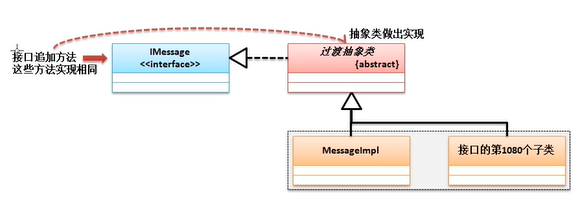
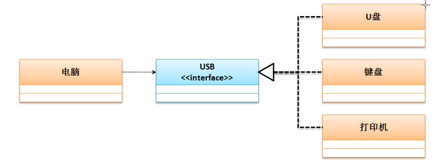

# 接口的定义与使用

若可以使用抽象类和接口设计进行设计，则基本就表示面向对象的概念理解了

## **接口基本定义**

抽象类中会保留一些普通方法，而普通方法可能会涉及到安全或隐私的操作问题。在进行开发的过程中，想对外部隐藏全部的实现细节，则可以通过接口来进行描述。

接口可以理解为一个纯粹的抽象类（最原始的定义接口中只包含抽象方法与全局常量），但是从jdk1.8开始由于引入了lambda表达式的概念，接口的定义也得到了加强，除了抽象方法与全局常量之外，还可以定义普通方法或静态方法。（接口之中的组成还是应该以抽象方法和全局常量为主）。

在Java中接口主要使用interface关键字进行定义

**范例：**定义一个接口

```java
// 由于类名称与接口名称的定义要求相同，为了区分接口，接口名称前往往会加上字母I
interface IMessage{// 定义了一个接口
    public static final String INFO = "www.mldn.cn"; // 全局常量
    public abstract String getInfo(); // 抽象方法
}
```

此时的接口无法直接产生实例化对象，所以对于接口的使用原则如下：

- 接口需要被子类实现，一个子类可以实现多个接口；
- 子类（如果不是抽象类），一定要覆写接口中的全部抽象方法；
- 接口对象可以利用子类的向上转型进行实例化

**范例**：定义接口子类

```java
// 由于类名称与接口名称的定义要求相同，为了区分接口，接口名称前往往会加上字母I
interface IMessage{// 定义了一个接口
    public static final String INFO = "www.mldn.cn"; // 全局常量
    public abstract String getInfo(); // 抽象方法
}
class MessageImpl implements IMessage{// 实现接口
    public String getInfo(){
        return "得到一个消息";
    }
}
public class JavaDemo{
    public static void main(String args[]){
        IMessage msg = new MessageImpl();  //
        System.out.println(msg.getInfo()); // 得到一个消息
        System.out.println(IMessage.INFO); // www.mldn.cn
    }
}
```

在Java中使用接口的主要目的是一个子类可以实现多个接口。利用接口可以实现多继承的概念。

**范例：**观察子类实现多接口

```java
// 由于类名称与接口名称的定义要求相同，为了区分接口，接口名称前往往会加上字母I
interface IMessage{// 定义了一个接口
    public static final String INFO = "www.mldn.cn"; // 全局常量
    public abstract String getInfo(); // 抽象方法
}
interface IChannel{
    public abstract boolean connect(); // 定义抽象方法
}
class MessageImpl implements IMessage,IChannel{// 实现接口
    public String getInfo(){
        if (this.connect()){
            return "得到一个消息";
        }else{
            return "通道创建失败,无法获取消息";
        }
    }
    public boolean connect(){
        System.out.println("消息发送通道成功建立");
        return true;
    }
}
public class JavaDemo{
    public static void main(String args[]){
        IMessage msg = new MessageImpl();  //
        System.out.println(msg.getInfo()); // 得到一个消息
        System.out.println(IMessage.INFO); // www.mldn.cn
    }
}
```

此时需要考虑对象的转型问题，上述程序中MessgaeImpl子类的对象可以任意的实现父接口的转换

**范例**：观察转换

```java
public class JavaDemo{
    public static void main(String args[]){
        IMessage msg = new MessageImpl();
        IChannel ichl = (IChannel) msg;
        System.out.println(ichl.connect()); // 得到一个消息
        System.out.println(IMessage.INFO); // www.mldn.cn
    }
}
```

由于MessageImpl子类实现了IMessgae和Ichannel两个接口，所以这个子类可以是这两个接口任意一个接口的实例，表示此时这两个接口实例之间是可以转换的。

**在Java程序中接口是不允许去结成父类的，所以接口绝对不是Object的子类，但是根据之前的分析可以发现，MessageImpl是Object子类，所以接口一定可以通过Object接收。**

**范例：**观察Object与接口转换

```java
public class JavaDemo{
    public static void main(String args[]){
        IMessage msg = new MessageImpl();
        Object obj = msg;  // 向上转型，接收接口对象
        IChannel ichl = (IChannel) obj;
        System.out.println(ichl.connect()); // 消息发送通道成功建立
//        System.out.println(IMessage.INFO); // www.mldn.cn
    }
}
```

由于接口描述的是一个公共的定义标准，所以在接口中所有抽象方法的访问权限都为public。

```java
// 完整定义
interface IMessage{// 定义了一个接口
    public static final String INFO = "www.mldn.cn"; // 全局常量
    public abstract String getInfo(); // 抽象方法
}

// 简化定义
interface IMessage{// 定义了一个接口
    String INFO = "www.mldn.cn"; // 全局常量
    String getInfo(); // 抽象方法
}
```

在实际开发过程中实现接口的有可能是抽象类，一个抽象类可以实现多个接口，而一个普通类只能继承一个抽象类并且可以实现多个父接口，但是要求先继承后实现。

**范例：**子类继承抽象类并且实现接口

```java
// 由于类名称与接口名称的定义要求相同，为了区分接口，接口名称前往往会加上字母I
interface IMessage{// 定义了一个接口
    public static final String INFO = "www.mldn.cn"; // 全局常量
    public abstract String getInfo(); // 抽象方法
}
interface IChannel{
    public abstract boolean connect(); // 定义抽象方法
}
abstract class DatabaseAbstract{ // 定义一个抽象类
    // 接口中的abstract可以省略，但是抽象类中不允许省略
    public abstract boolean getDatabaseConnection();
}
class MessageImpl extends DatabaseAbstract implements IMessage,IChannel{// 实现接口
    public String getInfo(){
        if (this.connect()){
            if (this.getDatabaseConnection()){
                return "数据库中得到一个消息";
            }else {
                return "数据库消息无法访问";
            }
        }else{
            return "通道创建失败,无法获取消息";
        }
    }
    public boolean connect(){
        System.out.println("消息发送通道成功建立");
        return true;
    }
    public boolean getDatabaseConnection(){
        return true;
    }
}
public class JavaDemo{
    public static void main(String args[]){
        IMessage msg = new MessageImpl();
        System.out.println(msg.getInfo());
    }
}
```

虽然接口无法继承一个父类，但是一个接口可以通过extends继承若干个父接口，此时成为接口的多继承

**范例：**实现接口多继承

```java
interface IMessage{// 定义了一个接口
    public abstract String getInfo(); // 抽象方法
}
interface IChannel{
    public abstract boolean connect(); // 定义抽象方法
}
// extends在类继承上只能继承一个父类，但接口上可以继承多个
interface IService extends IMessage,IChannel{ // 接口多继承
    public String service();
}
abstract class DatabaseAbstract{ // 定义一个抽象类
    // 接口中的abstract可以省略，但是抽象类中不允许省略
    public abstract boolean getDatabaseConnection();
}
class MessageService implements IService{// 实现接口
    public String getInfo(){
        return null;
    }
    public boolean connect(){
        return true;
    }
    public String service(){
        return "获取消息";
    }
}
```

在实际的开发中，接口的使用往往有三种形式：

- 进行标准设置；
- 表示一种操作的能力；
- 暴露远程方法视图，一般在RPC分布式开发中使用

## **接口定义加强**

接口的主要特点是全部由抽象方法和全局变量组成，若接口追加方法，则会造成接口子类全部需要覆写。为了方便子类的修改，往往不会让子类直接实现接口，而是中间追加一个过渡的抽象类。



但是从jdk1.8之后为了解决接口设计的缺陷，所以在接口中允许开发者定义普通方法

**范例：**观察普通方法定义

```java
interface IMessage{// 定义了一个接口
    public String message(); // 抽象方法
    public default boolean connect(){ // 方法是一个公共方法，都具备
        System.out.println("建立消息发送通道");
        return true;
    }
}

class MessageImpl implements IMessage{
    public String message(){
        return "www.mldn.cn";
    }
}
public class JavaDemo{
    public static void main(String args[]){
        IMessage msg = new MessageImpl();
        if (msg.connect()){
            System.out.println(msg.message());
        }
    }
```

接口的普通方法必须追加default的声明，但是需要注意的是，该操作属于挽救功能，如果不是必须的情况下不应该作为设计首选。

除了可以追加普通方法之外，接口中也可以定义static方法，而static方法可以通过接口直接调用

**范例：**在接口中定义static方法

```java
interface IMessage{// 定义了一个接口
    public String message(); // 抽象方法
    public default boolean connect(){ // 方法是一个公共方法，都具备
        System.out.println("建立消息发送通道");
        return true;
    }
    public static IMessage getInstance(){
        return new MessageImpl(); // 获得子类对象
    }
}

class MessageImpl implements IMessage{
    public String message(){
        if (this.connect()){
            return "www.mldn.cn";
        }else{
            return "没有消息发送";
        }
    }
}

public class JavaDemo{
    public static void main(String args[]){
        IMessage msg = IMessage.getInstance();
        if (msg.connect()){
            System.out.println(msg.message());
        }
    }
}
```

如果在接口里定义普通方法或者static方法，则这个功能就已经可以取代抽象类，但是不应该将这两个组成作为接口的主要设计原则，还是应该奉行：接口里就是抽象方法。

## **使用接口定义标准**

对于接口而言在开发中最为重要的应用就是进行标准的制定。



```java
interface IUSB{  // 定义USB标准
    public boolean check();
    public void work();
}

class Computer{
    public void plugin(IUSB usb){
        if(usb.check()){
            usb.work();  // 开始工作
        }else{
            System.out.println("硬件设备安装出现问题");
        }
    }
}

class Keyboard implements IUSB{
    public boolean check(){
        return true;
    }
    public void work(){
        System.out.println("开始进行码字工作");
    }
}

class Print implements IUSB{
    public boolean check(){
        return false;
    }
    public void work(){
        System.out.println("开始进行照片打印");
    }
}


public class JavaDemo{
    public static void main(String args[]){
        Computer computer = new Computer();
        computer.plugin(new Keyboard()); // 插入键盘
        computer.plugin(new Print()); // 插入打印机
    }
}
```

## 抽象类与接口的区别

在实际的开发中，抽象类与接口的定义形式非常相似，从jdk1.8开始就已非常明显。jdk1.8开始接口也可以定义default和static方法，但是这两者依然后明显的定义区别和使用区别。

| 区别 |  抽象类 |  接口 |
| ---- | :--: | ---- |
|   定义   |   abstract class 抽象类名称   |   interface 接口名称   |
|  组成    |   构造方法、抽象方法、普通方法、静态方法、全局常量、成员、static方法   |抽象方法、全局常量、普通方法、static方法  |
|   权限   |  可以使用各种权限定义    |   只能使用public   |
|   子类使用   |   子类通过extends关键字可以继承一个抽象类   |  子类使用implements关键字可以实现多个接口    |
|   两者关系   |   抽象类可以实现若干个接口|接口不允许继承抽象类，但允许继承多个父接口使用   1、抽象类或接口必须定义子类；2、子类一定要覆写抽象类或接口中的全部抽象方法；3、通过子类的向上转型实现抽象类或接口对象实例化   |

当抽象类和接口都可以使用的情况下，优先考虑接口。因为接口可以避免子类的单继承局限。另外从正常的设计角度而言，也需要先从接口进行项目的整体设计。

