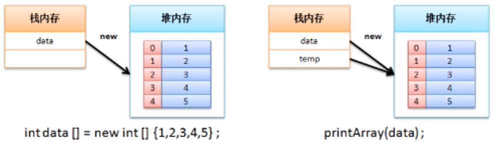
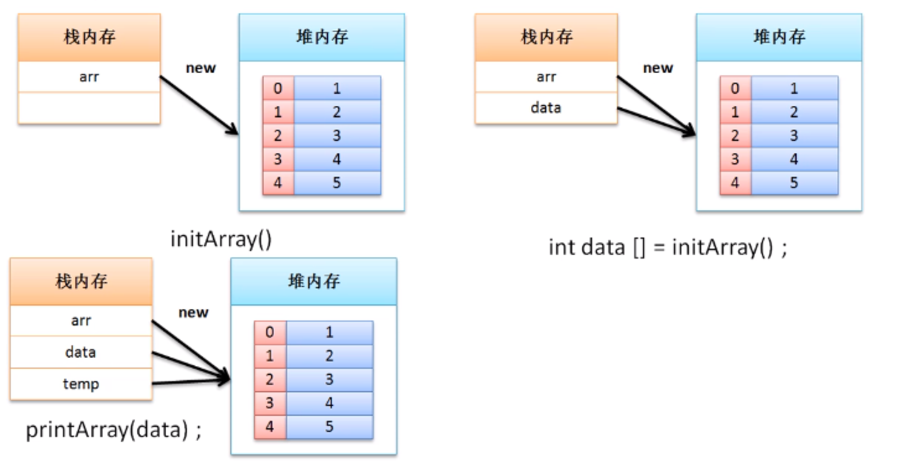
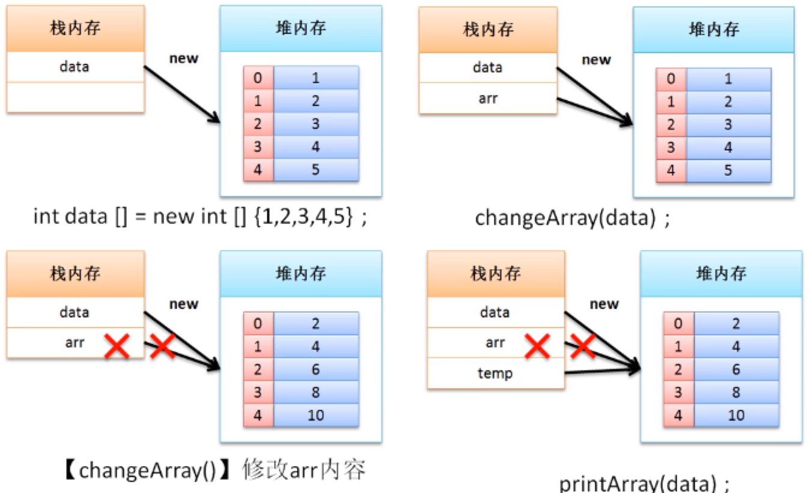

# 数组与方法

对于引用数据类型而言，主要的特点是可以与方法进行引用传递，而数组本身也属于引用类型，因此也可以通过方法实现引用传递

**范例：**实现数组的引用传递

```java
public class ArrayDemo {
    public static void main(String[] args){
        // 使用数组的静态初始化实现了数组的定义
        int data[] = new int[] {1,2,3,4,5};
        printArray(data);  //传递数组
    }
    public static void printArray(int temp[]){
        for (int x = 0; x < temp.length; x ++){
            System.out.println(temp[x]);
        }
    }
}
```

对于此时的引用传递，内存关系如下：



既然可以通过方法接收数组，那么也可以通过数组返回一个数组，那么此时只需要在方法的返回值类型上进行控制即可

**范例**：定义方法返回数组

```java
public class ArrayDemo {
    public static void main(String[] args){
        // 使用数组的静态初始化实现了数组的定义
        int data[] = initArray(); //通过方法获得数组内容
        printArray(data);  //传递数组
    }
    public static int[] initArray(){
        int arr[] = new int[] {1,2,3,4,5};
        return arr;
    }
    public static void printArray(int temp[]){
        for (int x = 0; x < temp.length; x ++){
            System.out.println(temp[x]);
        }
    }
}
```

根据上述程序进行**内存分析**：



**范例：**通过方法修改数组内容

```java
public class ArrayDemo {
    public static void main(String[] args){
        // 使用数组的静态初始化实现了数组的定义
        int data[] = new int[] {1,2,3,4,5};
        changeArray(data); // 修改数组内容
        printArray(data);  //传递数组
    }
    public static void changeArray(int arr[]){
        for (int x = 0; x < arr.length; x ++){
            arr[x] *= 2;   // 每个元素的内容乘2保存
        }
    }
    public static void printArray(int temp[]){
        for (int x = 0; x < temp.length; x ++){
            System.out.println(temp[x]);
        }
    }
}
```

根据上述程序进行**内存分析**：



案例：随意定义一个int数组，要求可以计算出这个数组元素的总和、最大值、最小值、以及平均值

```java
public class ArrayDemo {
    public static void main(String[] args){
        // 使用数组的静态初始化实现了数组的定义
        int data[] = new int[] {1,2,3,4,5};
        int sum = 0;
        double avg = 0.0;
        int max = data[0]; // 假设第一个是最大值
        int min = data[0]; // 假设第一个是最小值
        for (int x = 0; x < data.length; x++){
            if (data[x] > max){
                max = data[x];
            }
            if (data[x] < min){
                min = data[x];
            }
            sum += data[x];
        }
        avg = sum / data.length;
        System.out.println("数组总和："+sum);
        System.out.println("数组平均值："+avg);
        System.out.println("数组最大值："+max);
        System.out.println("数组最小值："+min);
        printArray(data);  //传递数组
    }

    public static void printArray(int temp[]){
        for (int x = 0; x < temp.length; x ++){
            System.out.println(temp[x]);
        }
    }
}
```

主方法所在的类为主类，主类不希望涉及到过于复杂的内容。在进行开发的过程中主方法本身就相当于一个客户端，而对于客户端的代码应该尽量简单一些，所以这个时候最好的做法是将一系列的计算交给单独的程序类去完成

**范例：**改善操作设计

```java
class ArrayUtil{// 是一个操作工具类
    private int sum;
    private double avg;
    private int max;
    private int min;
    public ArrayUtil(int data[]){
        this.max = data[0]; // 假设第一个是最大值
        this.min = data[0]; // 假设第一个是最小值
        for (int x = 0; x < data.length; x++){
            if (data[x] > this.max){
                this.max = data[x];
            }
            if (data[x] < min){
                this.min = data[x];
            }
            this.sum += data[x];
        }
        this.avg = this.sum / data.length;
    }
    public int getSum(){
        return this.sum;
    }
    public double getAvg(){
        return this.avg;
    }
    public int getMax(){
        return this.max;
    }
    public int getMin(){
        return this.min;
    }
}
public class ArrayDemo {
    public static void main(String[] args){
        // 使用数组的静态初始化实现了数组的定义
        int data[] = new int[] {1,2,3,4,5};
        ArrayUtil util = new ArrayUtil(data);
        System.out.println("数组总和："+util.getSum());
        System.out.println("数组平均值："+util.getAvg());
        System.out.println("数组最大值："+util.getMax());
        System.out.println("数组最小值："+util.getMin());
    }
}
```

