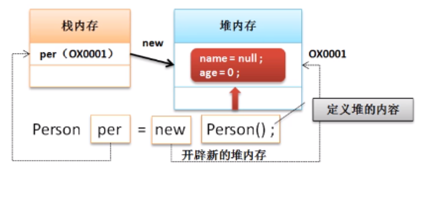
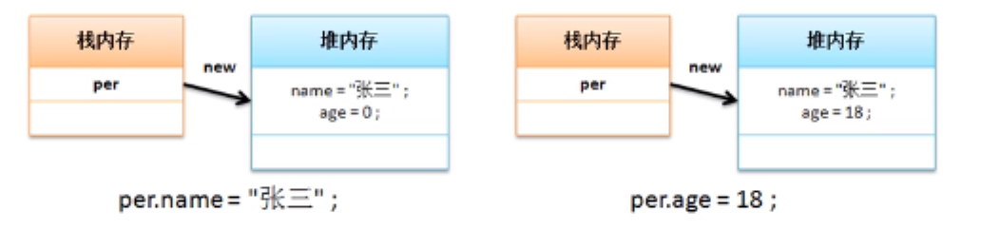
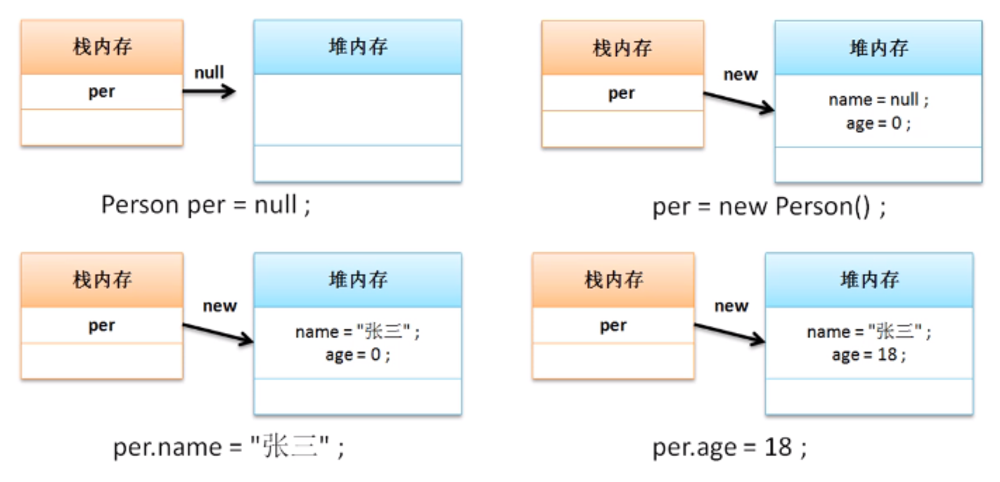

# 对象内存分析

java中类属于引用数据类型，引用数据类型最大的困难在于要进行内存的管理，同时在进行操作时也会发生内存关系的变化，本次针对之前程序的内存关系进行一些简单分析。

**范例：**以下面的程序为主进行分析

```java
class Person{ // 定义一个类
    String name;  // 人员的姓名
    int age;  // 人员的年龄
    public void tell(){
        System.out.println("姓名："+ name +"、年龄：" + age);
    }
}
public class JavaDemo {
    public static void main(String args[]){
        Person per = new Person(); // 声明并实例化对象
        per.name = "航航";
        per.age = 18;
        per.tell(); //进行方法的调用  姓名：航航、年龄：18
    }
}
```

如果要进行内存分析，那么首先要给出两块最为常用的内存空间：

- 堆内存：保存的是对象的具体信息，<font color='red'>在程序之中堆内存空间的开辟是通过new完成的</font>
- 栈内存：保存的是一块堆内存的地址，即通过地址找到堆内存，而后找到对象内容，但是为了分析简化起见可以简单的理解为：对象名称保存在了栈内存之中

## **内存分析**

Person per = new Person();



per.name = "张三"; per.age = 18;



对象的实例化有两种方法，一种是之前使用的声明并实例化对象，另一种就是分步完成，下面针对分步的内存操作进行分析。

**范例：**定义程序代码

```java
public class JavaDemo {
    public static void main(String args[]){
        Person per = null; // 声明对象
        per = new Person(); //实例化对象
        per.name = "张三";
        per.age = 18;
        per.tell(); //进行方法的调用
    }
}
```

## **内存分析**



需要特别注意的是，所有的对象在调用类中的属性或方法的时候必须要实例化完成后才能执行

