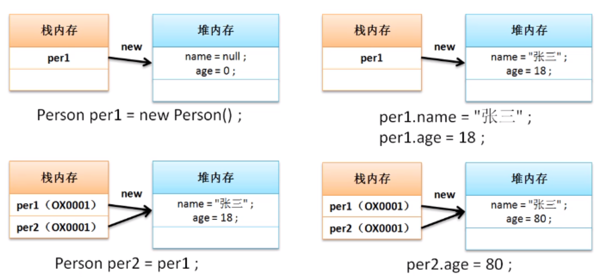
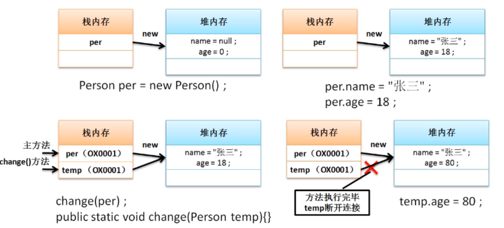

# 对象引用分析

类属于引用数据类型，而引用数据类型会牵扯到内存的引用传递。所谓的引用传递的本质：同一块堆内存空间可以被不同的栈内存所指向，也可以更换指向。

**范例：**定义一个引用传递的分析程序

```java
class Person{ // 定义一个类
    String name;  // 人员的姓名
    int age;  // 人员的年龄
    public void tell(){
        System.out.println("姓名："+ name +"、年龄：" + age);
    }
}
public class JavaDemo {
    public static void main(String args[]){
        Person per1 = new Person(); // 声明实例化对象
        per1.name = "张三";
        per1.age = 18;
        Person per2 = per1; //引用传递
        per2.age = 80;
        per1.tell(); //进行方法的调用  姓名：张三、年龄：80
    }
}
```

## **内存分析---> 引用传递**



这个时候的引用传递是直接在主方法中定义的，也可以通过**方法实现引用传递处理**

**范例：**利用方法实现引用传递处理

```java
class Person{ // 定义一个类
    String name;  // 人员的姓名
    int age;  // 人员的年龄
    public void tell(){
        System.out.println("姓名："+ name +"、年龄：" + age);
    }
}
public class JavaDemo {
    public static void main(String args[]){
        Person per = new Person(); // 声明实例化对象
        per.name = "张三";
        per.age = 18;
        change(per); //等价于Person temp = per
        per.tell(); //进行方法的调用
    }
    public static void change(Person temp){
        temp.age = 80;
    }
}
```

与之前的差别最大的地方在于，此时的程序是将Person类的实例化对象(内存地址、数值)传递到了change()方法中，由于传递的是Person类型，则change()方法接收的也是Person类型

## **内存分析**



引用传递可以发生在方法上，这个时候一定要观察方法的参数类型，同时也要观察方法的执行过程。

