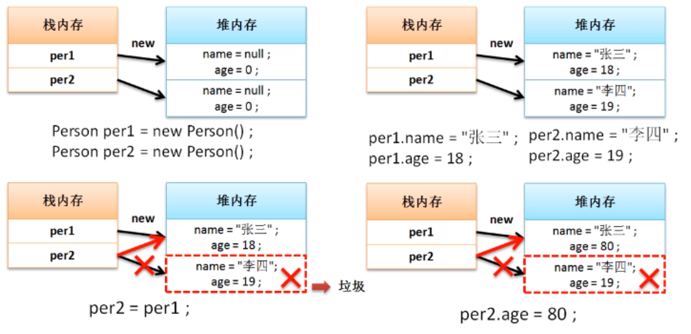

# 引用与垃圾产生分析

对于引用传递如果处理不当，则会造成垃圾的产生。

**范例：**定义一个要分析的程序

```java
public class JavaDemo {
    public static void main(String args[]){
        Person per1 = new Person(); // 声明实例化对象
        Person per2 = new Person();
        per1.name = "张三";
        per1.age = 18;
        per2.name = "李四";
        per2.age = 19;
        per2 = per1; //引用传递
        per2.age = 80;
        per1.tell(); //进行方法的调用
    }
}
```

上述代码已经明确发生了引用传递，并且也成功完成了引用传递的处理操作。下面观察其内存的分配与处理流程。<font color='red'>一个栈内存只能保存有一个堆内存的地址数据，如果发生更改，则之前的地址数据将从此栈内存中彻底消失。</font>

## **内存分析**



所谓的**垃圾空间**指的是没有任何栈内存所指向的堆内存空间，所有的垃圾将被GC(Garbage Collector垃圾收集器)不定期进行回收并且释放无用内存空间，但是如果垃圾过多，一定将影响到GC的处理性能，从而降低整体的程序性能。在实际的开发中，对于垃圾的产生应该越少越好。