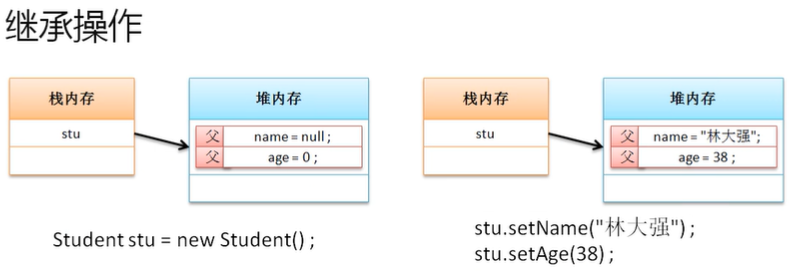
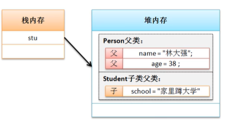

# 继承的定义与使用

面向对象的第二大特征是继承性，继承性的主要特点在于：可以扩充已有类的特征

## **继承问题引出**

结构合理、适合维护、重用性高才是良好的代码

**范例：**传统定义两个类：人和学生

```java
class Person{
    private String name;
    private int age;
    public Person(String name,int age){
        this.name = name;
        this.age = age;
    }
    public void setName(String name){
        this.name = name;
    }
    public String getName(){
        return this.name;
    }
    public void setAge(int age){
        this.age = age;
    }
    public int getAge(){
        return this.age;
    }
    public String getInfo(){
        return "姓名："+this.name+"、年龄："+this.age;
    }
}

class Student{
    private String sname;
    private int age;
    private double score;
    public Student(String sname,int age,double score){
        this.sname = sname;
        this.age = age;
        this.score = score;
    }
    public void setSname(String sname){
        this.sname = sname;
    }
    public String getSname(){
        return this.sname;
    }
    public void setAge(int age){
        this.age = age;
    }
    public int getAge(){
        return this.age;
    }
    public void setScore(double score){
        this.score = score;
    }
    public double getScore(){
        return this.score;
    }
    public String getInfo(){
        return "学生姓名："+this.sname+"、年龄："+this.age+"、考试成绩："+this.score;
    }
}
```

虽然类的概念可以解决结构性的问题，但是对于之前的开发程序代码总能够发现有一些重复的代码；思考关系发现：学生是一个人，人是一个更加广泛的定义范畴，学生是一个相对狭小的定义范畴。学生中应该包含人的所有特点。

如果想进行代码的重用，必须使用继承的概念，继承的本质是在已有类的功能上进行功能的扩充

## **继承的实现**

如果在java中想实现继承关系，必须依靠extends关键字完成，此关键字的具体语法如下：

```java
class 子类 extends 父类
```

通常子类也被称为派生类，父类也被称为超类（SuperClass）

**范例：**观察继承的实现

```java
class Person{
    private String name;
    private int age;
    public void setName(String name){
        this.name = name;
    }
    public String getName(){
        return this.name;
    }
    public void setAge(int age){
        this.age = age;
    }
    public int getAge(){
        return this.age;
    }
    public String getInfo(){
        return "姓名："+this.name+"、年龄："+this.age;
    }
}

class Student extends Person{ // Student是子类
    // 在子类中不定义任何功能
}

public class JavaDemo{
    public static void main(String args[]){
        Student stu = new Student();
        stu.setName("航航"); // 父类定义
        System.out.println("姓名："+stu.getName()+"、年龄："+stu.getAge());
    }
}
```

此时存在有继承关系，所以此时的子类即便没有定义任何操作，也可以直接通过父类继承而来的方法实现相应的功能，此时的内存关系：



继承实现的主要目的在于子类可以重用父类中的结构，也可以实现功能的扩充，同时强调了子类可以定义更多的内容，并且描述范围更小

**范例：**子类扩充定义

```java
class Person{
    private String name;
    private int age;
//    public Person(String name,int age){
//        this.name = name;
//        this.age = age;
//    }
    public void setName(String name){
        this.name = name;
    }
    public String getName(){
        return this.name;
    }
    public void setAge(int age){
        this.age = age;
    }
    public int getAge(){
        return this.age;
    }
    public String getInfo(){
        return "姓名："+this.name+"、年龄："+this.age;
    }
}

class Student extends Person{ // Student是子类
    private String school;
    public void setSchool(String school){
        this.school = school;
    }
    public String getSchool(){
        return this.school;
    }
}

public class JavaDemo{
    public static void main(String args[]){
        Student stu = new Student();
        stu.setName("航航"); // 父类定义
        stu.setSchool("清华大学");
        System.out.println("姓名："+stu.getName()+"、年龄："+stu.getAge()+"、学校："+stu.getSchool());
    }
}
```



## **子类对象实例化流程**

在进行子类对象实例化时一定要默认实例化好父类对象

**范例：**观察一个程序

```java
class Person{
    public Person(){
        System.out.println("一个新的Person父类实例化对象产生了");
    }
}
class Student extends Person{ // Student是子类
    public Student(){
        System.out.println("一个新的Student子类实例化对象产生了");
    }
}
public class JavaDemo{
    public static void main(String args[]){
        new Student(); 
    }
}
```

执行结果：

一个新的Person父类实例化对象产生了

一个新的Student子类实例化对象产生了

即使没有进行父类对象实例化，也会由系统自动调用父类的构造方法（实例化父类对象），默认情况下子类实例化对象过程会自动实例化父类对象。实际上这个时候相当于子类的构造方法中隐含了一个“super()”的形式

**范例：**修改子类定义

```java
class Person{
    public Person(){
        System.out.println("一个新的Person父类实例化对象产生了");
    }
}
class Student extends Person{ // Student是子类
    public Student(){
        super(); // 写与不写此语句效果都一样，但是如果写需写在第一行
        System.out.println("一个新的Student子类实例化对象产生了");
    }
}
public class JavaDemo{
    public static void main(String args[]){
        new Student();
    }
}
```

super()表示子类构造调用父类构造的语句，该语句只允许放在子类构造方法的首行。在默认情况下的实例化处理，子类只会调用父类中的无参构造方法，所以写不写super()区别不大，但是如果父类中没有提供无参构造，此时必须用super()明确调用有参构造。

**范例：**

```java
class Person{
    private String name;
    private int age;
    public Person(String name,int age){
        this.name = name;
        this.age = age;
        System.out.println("一个新的Person父类实例化对象产生了");
    }
}
class Student extends Person{ // Student是子类
    private String school;
    public Student(String name,int age,String school){
        super(name,age); // 明确调用有参构造
        this.school = school;
        System.out.println("一个新的Student子类实例化对象产生了");
    }
}
public class JavaDemo{
    public static void main(String args[]){
        new Student("张三",18,"清华大学");
    }
}
```

结论：在实例化子类对象的同时一定会实例化父类对象，目的是为了所有的属性可以进行空间的分配。**super与this都可以调用构造方法，super是由子类调用父类的构造，this是调用本类构造，并且一定要放在构造方法的首行，因此两个语句不允许同时出现。**

## **继承定义限制**

1、Java中不允许多重继承，值允许多层继承

- 在程序逻辑中，一个子类只能继承一个父类

  ```java
  // 错误的继承
  class A{}
  class B{}
  class C extends A,B{}  // 多重继承
  ```

  继承主要目的是扩展已有类的功能，但是多重继承的目的是希望可以同时继承多个类中的方法。而面对于多继承的要求应该将范围限定在同一类中；如果现在使用了多层继承，这时对C类也同样可以继承多个父类的操作。但是多层继承也应该有一个限度，对于继承关系而言，理论上层次不应该超过三层

  ```java
  // 正确的继承
  class A{}
  class B extends A{}
  class C extends B{}  // 多重继承
  ```

2、在进行继承关系定义时，子类可以继承父类中所有的操作结构，但是对于私有操作属于隐式继承，而所有的非私有操作属于显式继承。

```java
class Person{
    private String name;
    public void setName(String name){
        this.name = name;
    }
    public String getName(){
        return this.name;
    }
}

class Student extends Person{ // Student是子类
    public Student(String name){
        setName(name);
    }
    public void fun(){
//        System.out.println(name);  // 不能直接访问name是私有的
        System.out.println(getName());
    }
}

public class JavaDemo{
    public static void main(String args[]){
        Student stu = new Student("张三");
        stu.fun();
    }
}
```

继承一旦发生了，所有的操作都可以被子类使用，子类至少会维持父类的现有功能

