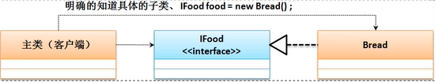
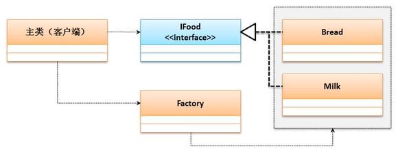

# 工厂与代理设计模式

## **工厂设计模式**

对于接口而言必须有子类，并且子类可以通过对象的向上转型来获取接口的实例化对象，但是在进行对象实例化过程中也可能存在设计问题。

**范例：**观察如下一个程序

```java
interface IFood{  // 定义一个食物标准
    public void eat();
}

class Bread implements IFood{
    public void eat(){
        System.out.println("吃面包");
    }
}

public class JavaDemo{
    public static void main(String args[]){
        IFood food = new Bread();
        food.eat(); //吃面包
    }
}
```

上述程序中根据接口进行子类的定义，并且利用对象的向上转型进行接口对象实例化，而此时程序结构如下：



上述代码客户端需要明确的知道具体哪一个子类

**范例：**扩展一类食物

```java
interface IFood{  // 定义一个食物标准
    public void eat();
}

class Bread implements IFood{
    public void eat(){
        System.out.println("吃面包");
    }
}

class Milk implements IFood{
    public void eat(){
        System.out.println("喝牛奶");
    }
}
public class JavaDemo{
    public static void main(String args[]){
        IFood food = new Milk();
        food.eat(); //喝牛奶
    }
}
```

此时的程序表示出现有耦合的问题，而造成耦合问题的原因是：“关键字new”，良好的设计应该避免耦合。

**范例：**工厂设计实现

```java
interface IFood{  
    public void eat();
}

class Bread implements IFood{
    public void eat(){
        System.out.println("吃面包");
    }
}

class Milk implements IFood{
    public void eat(){
        System.out.println("喝牛奶");
    }
}

class Factory{
    public static IFood getInstance(String className){
        if ("bread".equals(className)){
            return new Bread();
        } else if ("milk".equals(className)){
            return new Milk();
        } else {
            return null;
        }
    }
}

public class JavaDemo{
    public static void main(String args[]){
        IFood food = Factory.getInstance("bread");
        food.eat();
    }
}
```

在本程序中，客户端程序类与IFood接口的子类没有任何关联，所有的关联都是通过Factory类完成的，在程序运行时可以通过初始化参数进行要使用的子类定义。



## **代理设计模式（Proxy）**

代理设计模式的主要功能是可以帮助用户将所有的开发注意力只集中在核心业务功能的处理上。


**范例：**实现代理设计

```java
interface IEat{
    public void get();
}

class EatReal implements IEat{
    public void get(){
        System.out.println("得到一份食物，然后开始品尝美味");
    }
}

class EatProxy implements IEat{  // 服务代理
    private IEat eat; // 为吃服务
    public EatProxy(IEat eat){
        this.eat = eat;
    }
    public void get(){
        this.prepare();
        this.eat.get();
        this.clear();
    }
    public void prepare(){ // 准备过程
        System.out.println("1、精心购买食材");
        System.out.println("2、处理食材");
    }
    public void clear(){
        System.out.println("3、收拾碗筷");
    }
}

public class JavaDemo{
    public static void main(String args[]){
        IEat eat = new EatProxy(new EatReal());
        eat.get();
    }
}
```

代理你设计模式的主要特点是：一个接口提供有两个子类，其中一个子类是真实业务操作类，另一个子类是代理业务操作类。如果没有代理业务操作，真实业务无法执行。

