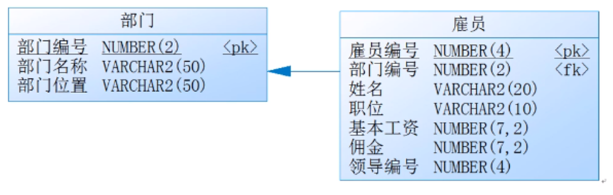
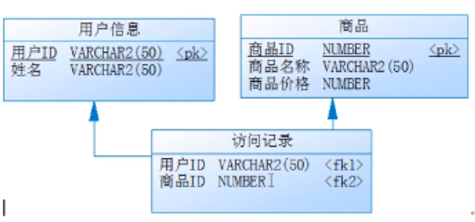
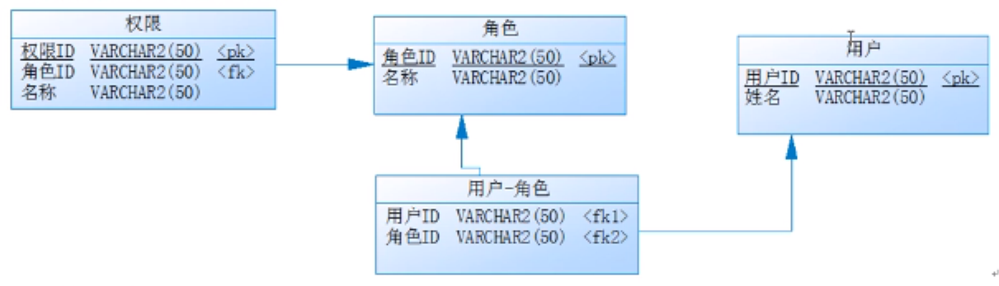

## **综合实战：数据表与简单java类映射转换**



在上述对应的数据表的关系之中可以发现有如下的关联存在：

- 一个部门有多个雇员
- 一个雇员属于一个部门
- 一个雇员有一个领导

将上述数据表转为简单java类的定义形式，在整体的程序代码中，要求可以获得如下信息：

- 根据部门信息获得以下内容

- - 一个部门的完整信息
  - 一个部门中所有雇员的完整信息
  - 

- 根据雇员信息获得以下内容：

- - 一个雇员对应所在部门信息；
  - 一个雇员对应的领导信息

对于数据表与简单Java类之间的映射最好的解决步骤：先抛开所有的关联字段，写出类的基本组成，然后再通过引用配置关联字段的定义。

**第一步：**分别定义Emp、Dept两个实体类

```java
class Emp{
    private long empno;
    private String ename;
    private String job;
    private double sal;
    private double comm;
    private Emp(long empno, String ename, String job, double sal,double comm){
        this.empno = empno;
        this.ename = ename;
        this.job = job;
        this.sal = sal;
        this.comm = comm;
    }
    // setter、getter、无参构造略
    public String getInfo(){
        return "【雇员信息】雇员编号="+ this.empno + "、雇员姓名="+this.ename+"、雇员职位="+this.job+"、基本工资="+this.sal+"、佣金="+this.comm;
    }

}
class Dept{
    private long deptno;
    private String dname;
    private String loc;
    public Dept(long deptno,String dname,String loc){
        this.deptno = deptno;
        this.dname = dname;
        this.loc = loc;
    }
    // setter、getter、无参构造略
    public String getInfo(){
        return "[部门信息]部门编号 = " + this.deptno + "、部门名称：" + this.dname + "、部门位置："+ this.loc;
    }
}
```

**第二步：**配置所有的关联字段

```java
class Emp{
    private long empno;
    private String ename;
    private String job;
    private double sal;
    private double comm;
    private Dept dept;  // 所属部门
    private Emp mgr;  // 所属领导
    private Emp(long empno, String ename, String job, double sal,double comm){
        this.empno = empno;
        this.ename = ename;
        this.job = job;
        this.sal = sal;
        this.comm = comm;
    }
    // setter、getter、无参构造略
    public String getInfo(){
        return "【雇员信息】雇员编号="+ this.empno + "、雇员姓名="+this.ename+"、雇员职位="+this.job+"、基本工资="+this.sal+"、佣金="+this.comm;
    }
    public void setDept(Dept dept){
        this.dept = dept;
    }
    public void setMgr(Emp mgr){
        this.mgr = mgr;
    }
    public Dept getDept(){
        return this.dept;
    }
    public Emp getMgr(){
        return this.mgr;
    }

}
class Dept{
    private long deptno;
    private String dname;
    private String loc;
    private Emp emps[]; // 多个雇员信息

    public Dept(long deptno,String dname,String loc){
        this.deptno = deptno;
        this.dname = dname;
        this.loc = loc;
    }
    // setter、getter、无参构造略
    public String getInfo(){
        return "[部门信息]部门编号 = " + this.deptno + "、部门名称：" + this.dname + "、部门位置："+ this.loc;
    }
    public void setEmps(Emp emps[]){
        this.emps = emps;
    }
    public Emp[] getEmps(){
        return this.emps;
    }
}
```

在进行实际项目开发过程中一定是分两个步骤实现的：

- 第一步：根据表的结构关系进行对象的配置
- 第二步：根据要求通过结构获取数据

**第三步**：实现项目开发要求

```java
class Emp{
    private long empno;
    private String ename;
    private String job;
    private double sal;
    private double comm;
    private Dept dept;  // 所属部门
    private Emp mgr;  // 所属领导
    Emp(long empno, String ename, String job, double sal,double comm){
        this.empno = empno;
        this.ename = ename;
        this.job = job;
        this.sal = sal;
        this.comm = comm;
    }
    // setter、getter、无参构造略
    public String getInfo(){
        return "【雇员信息】雇员编号="+ this.empno + "、雇员姓名="+this.ename+"、雇员职位="+this.job+"、基本工资="+this.sal+"、佣金="+this.comm;
    }
    public void setDept(Dept dept){
        this.dept = dept;
    }
    public void setMgr(Emp mgr){
        this.mgr = mgr;
    }
    public Dept getDept(){
        return this.dept;
    }
    public Emp getMgr(){
        return this.mgr;
    }

}
class Dept{
    private long deptno;
    private String dname;
    private String loc;
    private Emp emps[]; // 多个雇员信息

    public Dept(long deptno,String dname,String loc){
        this.deptno = deptno;
        this.dname = dname;
        this.loc = loc;
    }
    // setter、getter、无参构造略
    public String getInfo(){
        return "[部门信息]部门编号 = " + this.deptno + "、部门名称=" + this.dname + "、部门位置="+ this.loc;
    }
    public void setEmps(Emp emps[]){
        this.emps = emps;
    }
    public Emp[] getEmps(){
        return this.emps;
    }
}
public class JavaDemo{
    public static void main(String args[]){
        //第一步：根据关系进行类的定义
        //定义出各个实例化对象，此时并没有任何的关联定义
        Dept dept = new Dept(10,"财务部","上海");
        Emp empA = new Emp(7369,"SMITH","CLERK",800,0);
        Emp empB = new Emp(7566,"FORD","MANAGER",2450,0);
        Emp empC = new Emp(7839,"KING","PRESIDENT",5000,0);
        // 需要为对象进行关联设置
        empA.setDept(dept); // 设置雇员与部门的关联
        empB.setDept(dept); // 设置雇员与部门的关联
        empC.setDept(dept); // 设置雇员与部门的关联
        empA.setMgr(empB); // 设置雇员与领导的关联
        empB.setMgr(empC); // 设置雇员与领导的关联
        dept.setEmps(new Emp[] {empA,empB,empC}); // 部门与雇员
        // 第二步：根据关系获取数据
        System.out.println(dept.getInfo());
        for (int x = 0; x< dept.getEmps().length; x ++){
            System.out.println("\t|-"+dept.getEmps()[x].getInfo());
            if (dept.getEmps()[x].getMgr() != null){
                System.out.println("\t\t|-"+dept.getEmps()[x].getMgr().getInfo());
            }
        }
        System.out.println("---------------");
        System.out.println(empB.getDept().getInfo());
        System.out.println(empA.getMgr().getInfo());  // 获取领导信息
    }
}
```

---

## **综合实战：一对多映射**

按照表的要求将表的结构转换为类结构，同时可以获取如下信息：

- 获取一个分类的完整信息
- 可以根据分类获取其对应的所有子分类的信息

```java
class Item{
    private long iid;
    private String title;
    private SubItem subitems[];

    public Item(long iid,String title){
        this.iid = iid;
        this.title = title;
    }
    public void setSubitems(SubItem subitems[]){
        this.subitems = subitems;
    }
    public SubItem[] getSubitems(){
        return this.subitems;
    }
    public String getInfo(){
        return "【分类信息】iid="+this.iid+"、titile="+this.title;
    }
}
class SubItem{
    private long sid;
    private String title;
    private Item item;
    public SubItem(long sid,String title){
        this.sid = sid;
        this.title = title;
    }
    public void setItem(Item item){
        this.item = item;
    }
    public Item getItem(){
        return this.item;
    }
    public String getInfo(){
        return "【子分类信息】iid="+this.sid+"、titile="+this.title;
    }
}

public class JavaDemo{
    public static void main(String args[]){
        //第一步：根据结构设置对象数据
        Item item = new Item(1L,"图书");
        SubItem subItems[] = new SubItem[]{
                new SubItem(10L,"编程图书"),
                new SubItem(20L,"图形图像类图书")
        };
        item.setSubitems(subItems);
        //第二步：根据要求获取数据
        for (int x = 0; x < subItems.length;x++){
            subItems[x].setItem(item);
        }
        System.out.println(item.getInfo());
        for (int x = 0; x < item.getSubitems().length; x++){
            System.out.println("\t|-"+item.getSubitems()[x].getInfo());
        }
    }
}
```

---

## **综合实战：多对多复杂映射**



将以上的结构转换为类结构，并且可以获取如下信息：

- 获取一个用户访问的所有商品的详细信息
- 获取一个商品被浏览过的全部的用户信息

此时的程序只要去考虑实体表的设计即可，对于中间的访问记录信息表不需要进行转换处理，只定义两个类即可

```java
class Member{
    private long mid;
    private String name;
    private Product products[];
    public Member(long mid, String name){
        this.mid = mid;
        this.name = name;
    }
    public String getInfo(){
        return "【用户信息：】用户ID："+this.mid+"、用户姓名："+this.name;
    }
    public void setProducts(Product products[]){
        this.products = products;
    }
    public Product[] getProducts(){
        return this.products;
    }
    //setter、getter略
}

class Product{
    private long pid;
    private String pname;
    private double price;
    private Member members[];
    public Product(long pid,String pname,double price){
        this.pid = pid;
        this.pname = pname;
        this.price = price;
    }
    public String getInfo(){
        return "【商品信息：】商品ID"+this.pid+"、商品名称："+this.pname+"、商品价格："+this.price;
    }
    public void setMembers(Member members[]){
        this.members = members;
    }
    public Member[] getMembers(){
        return this.members;
    }
    //setter、getter略

}

public class JavaDemo{
    public static void main(String args[]){
        // 第一步：根据结构设置对象
        Member memberA = new Member(1001,"张三");
        Member memberB = new Member(1002,"李四");
        Product productA = new Product(01L,"java开发图书",79.8);
        Product productB = new Product(02L,"Beats",2309.8);
        Product productC = new Product(03L,"小米手机",3000.8);
        memberA.setProducts(new Product[] {productA,productB,productC});
        memberB.setProducts(new Product[] {productA});
        productA.setMembers(new Member[] {memberA,memberB});
        productB.setMembers(new Member[] {memberA});
        productC.setMembers(new Member[] {memberA});

        // 第二步：根据要求获取数据
        System.out.println("------------根据商品找到浏览用户的记录-------------");
        System.out.println(productA.getInfo());
        for (int x = 0; x < productA.getMembers().length; x++){
            System.out.println("\t|-"+productA.getMembers()[x].getInfo());
        }
        System.out.println("------------根据用户查看浏览商品信息-------------");
        System.out.println(memberA.getInfo());
        for (int y = 0; y < memberA.getProducts().length; y++){
            System.out.println("\t|-"+memberA.getProducts()[y].getInfo());
        }
    }
}
```

---

## **综合实战：复杂多对多**

在实际项目开发过程中，对于用户的授权管理是一项重要的任务，下面给出了一个最为常见的用户权限管理的表结构设计，基本的关系如下：

- 一个用户可以拥有多个角色，一个角色可能是多个用户
- 一个角色可以拥有多个权限



要求实现如下查询功能：

- 可以根据一个用户找到该用户对应的所有角色，以及每一个角色对应的所有权限信息；
- 可以根据一个角色找到该角色下的所有权限，以及拥有此角色的全部用户信息
- 可以根据一个权限找到具备此权限的所有用户信息

```java
class Member{
    private long mid;
    private String name;
    private Role roles[];
    public Member(long mid, String name){
        this.mid = mid;
        this.name = name;
    }
    public String getInfo(){
        return "【用户信息：】用户ID："+this.mid+"、用户姓名："+this.name;
    }
    public void setRoles(Role roles[]){
        this.roles = roles;
    }
    public Role[] getRoles(){
        return this.roles;
    }
    //setter、getter略
}

class Role{
    private long rid;
    private String rname;
    private Member members[];
    private Privilege privileges[];
    public Role(long rid,String rname){
        this.rid = rid;
        this.rname = rname;
    }
    public String getInfo(){
        return "【角色信息：】角色ID："+this.rid+"、角色名称："+this.rname;
    }
    public void setPrivileges(Privilege privileges[]){
        this.privileges = privileges;
    }
    public Privilege[] getPrivileges(){
        return this.privileges;
    }
    public void setMembers(Member members[]){
        this.members = members;
    }
    public Member[] getMembers(){
        return this.members;
    }
    //setter、getter略
}

class Privilege{
    private long pid;
    private String pname;
    private Role role;
    public Privilege(long pid,String pname){
        this.pid = pid;
        this.pname = pname;
    }
    public String getInfo(){
        return "【权限信息：】权限ID："+this.pid+"、权限名称："+this.pname;
    }
    public void setRoles(Role role){
        this.role = role;
    }
    public Role getRole(){
        return this.role;
    }
}

public class JavaDemo{
    public static void main(String args[]){
        // 第一步：根据结构设置对象
        Member memberA = new Member(1001,"张三");
        Member memberB = new Member(1002,"李四");
        Role roleA = new Role(001,"罗密欧");
        Role roleB = new Role(002,"朱丽叶");
        Role roleC = new Role(003,"哈姆雷特");
        Privilege privilegeA = new Privilege(11,"权限1");
        Privilege privilegeB = new Privilege(12,"权限2");
        Privilege privilegeC = new Privilege(13,"权限3");
        memberA.setRoles(new Role[]{roleA,roleC});
        memberB.setRoles(new Role[]{roleB});
        roleA.setMembers(new Member[]{memberA});
        roleB.setMembers(new Member[]{memberB});
        roleC.setMembers(new Member[]{memberA});
        roleA.setPrivileges(new Privilege[]{privilegeA});
        roleB.setPrivileges(new Privilege[]{privilegeB});
        roleC.setPrivileges(new Privilege[]{privilegeC});
        privilegeA.setRoles(roleA);
        privilegeB.setRoles(roleB);
        privilegeC.setRoles(roleC);

        // 第二步：根据要求获取数据
        System.out.println("------------根据用户找到对应的角色-------------");
        System.out.println(memberA.getInfo());
        for (int x = 0; x < memberA.getRoles().length; x++){
            System.out.println("\t|-"+memberA.getRoles()[x].getInfo());
            for (int y =0; y < memberA.getRoles()[x].getPrivileges().length;y++){
                System.out.println("\t\t|-"+memberA.getRoles()[x].getPrivileges()[y].getInfo());
            }
        }
        System.out.println("------------根据角色找到所有权限-------------");
        System.out.println(roleA.getInfo());
        for (int x = 0; x < roleA.getPrivileges().length; x++){
            System.out.println("\t|-"+roleA.getPrivileges()[x].getInfo());
        }
        for (int y = 0; y < roleA.getMembers().length; y++){
            System.out.println("\t|-"+roleA.getMembers()[y].getInfo());
        }
        System.out.println("------------根据权限找到所有用户信息-------------");
        System.out.println(privilegeA.getInfo());
        for (int k = 0 ;k < privilegeA.getRole().getMembers().length; k++){
            System.out.println("\t|-"+privilegeA.getRole().getMembers()[k].getInfo());
        }
    }
}
```

