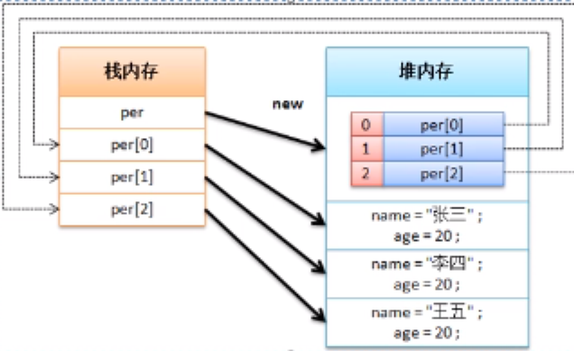

# 对象数组

在java程序本身各种数据类型都可以成为数组类型，所以类也可以成为数组类型，这样的数组就称为对象数组，对象数组的定义格式如下：

- 动态初始化：类 对象数组名称[] = new 类[长度]：每一个元素的内容都是null

- 静态初始化：类 对象数组名称[] = new 类[] {实例化对象，实例化对象，...}


**范例：**使用动态初始化定义对象数组

```java
class Person{
    private String name;
    private int age;
    public Person(String name,int age){
        this.name = name;
        this.age = age;
    }
    public String getInfo(){
        return "姓名："+ this.name + "、年龄：" + this.age;
    }
    // setter、getter略
}
public class ArrayDemo {
    public static void main(String[] args){
        Person per[] = new Person[3];
        per[0] = new Person("张三",20);
        per[1] = new Person("李四",20);
        per[2] = new Person("王五",20);
        for (int x = 0 ; x < per.length; x ++){
            System.out.println(per[x].getInfo());
        }
    }
}
```

**范例：**对象数组的静态初始化

```java
class Person{
    private String name;
    private int age;
    public Person(String name,int age){
        this.name = name;
        this.age = age;
    }
    public String getInfo(){
        return "姓名："+ this.name + "、年龄：" + this.age;
    }
    // setter、getter略
}
public class ArrayDemo {
    public static void main(String[] args){
        Person per[] = new Person[] {
                new Person("张三",20),
                new Person("李四",20),
                new Person("王五",20)
        }; // 对象数组
        for (int x = 0 ; x < per.length; x ++){
            System.out.println(per[x].getInfo());
        }
    }
}
```

对于对象数组而言，本身只是更换了一种数组定义的类型，但是这个时候内存图比较麻烦



所有的开发都不可能离开对象数组，数组中的最大缺陷：长度是固定的。优势：数据线性保存，根据索引访问，速度较快（时间复杂度为“1”）

