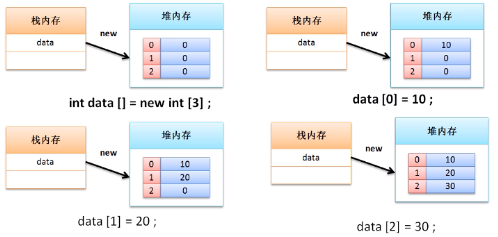
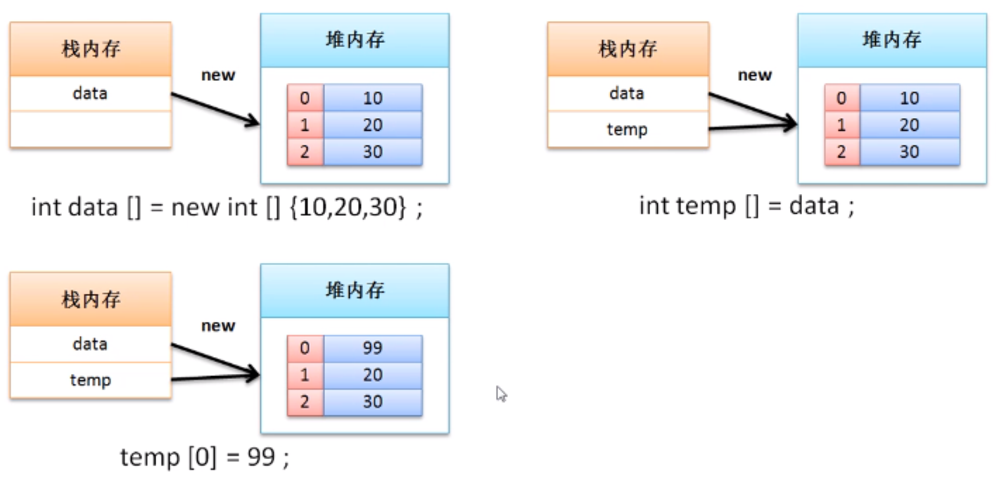

# 数组引用传递分析

通过数组的定义发现，在数组的使用过程之中已然需要关键字new进行内存空间的开辟，同理，这里也存在内存的关系匹配

**范例：**定义简单代码

```java
public class ArrayDemo {
    public static void main(String args[]){
        // 使用数组的动态初始化实现了数组的定义
        int data[]= new int[3];
        data[0] = 10; // 为数组设置内容
        data[1] = 20;  // 为数组设置内容
        data[2] = 30;  // 为数组设置内容
        System.out.println(data.length);
        for(int x= 0; x<data.length ;x++){
            System.out.println(data[x]);
        }
    }
}
```

**数组内存分析**



但是数组本身属于引用数据类型，那么一定会发生引用传递，引用传递还是按照传统的方式：一个堆内存可以被多个栈内存所指向。

**范例：**观察数组引用

```java
public class ArrayDemo {
    public static void main(String[] args){
        // 使用数组的动态初始化实现了数组的定义
        int data[] = new int[] {10,20,30};
        int temp[] = data;  // 引用传递
        temp[0] = 99;
        for (int x = 0; x < data.length; x ++) {
            System.out.println(data[x]); //99,20,30
        }
    }
}
```



由于数组属于引用类型，所以一定要为其开辟堆内存空间之后才可以使用，如果现在使用了未开辟堆内存空间数组，则一定会出现“NullPionterException"

```java
public class ArrayDemo {
    public static void main(String[] args){
        // 使用数组的动态初始化实现了数组的定义
        int data[] = null;
        System.out.println(data[0]);
    }
}
Exception in thread "main" java.lang.NullPointerException at ArrayDemo.main(ArrayDemo.java:5)
```

**必须提供实例化对象才可以使用数组的操作形式进行操作**

