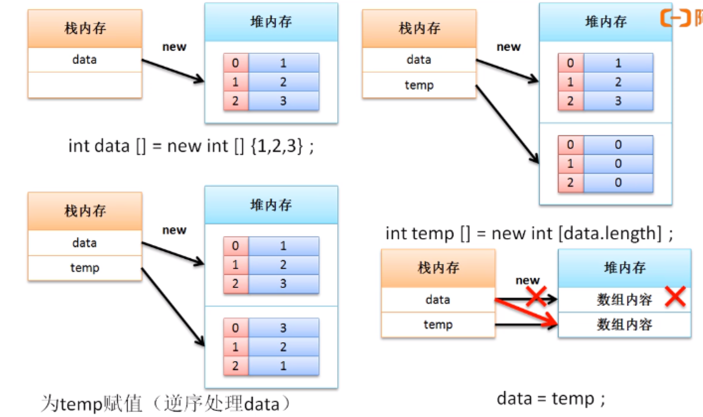

# 数组转置案例分析

转置：即将数组的内容首尾交换

案例：将数组内容1、2、3、4、5、6、7、8、9交换为9、8、7、6、5、4、3、2、1

**做法一：**定义一个新的数组而后按逆序的方式保存

```java
public class ArrayDemo {
    public static void main(String[] args){
        // 使用数组的静态初始化实现了数组的定义
        int data[] = new int[] {1,2,3,4,5,6,7,8,9};
        int temp[] = new int [data.length]; //第二个数组
        int foot = temp.length - 1;
        for (int x = 0; x < data.length; x++){
            temp[foot --] = data[x];
        }
        data = temp;
        printArray(data);
    }
    public static void printArray(int temp[]){
        for (int x = 0; x < temp.length; x ++){
            System.out.print(temp[x]+"、");
        }
    }
}
```

**内存分析：**会产生无用的垃圾空间



**做法二：**在一个数组上进行转置，此时需要确定的是数组转换的次数，次数的计算：数组长度//2

```java
public class ArrayDemo {
    public static void main(String[] args){
        // 使用数组的静态初始化实现了数组的定义
        int data[] = new int[] {1,2,3,4,5,6,7,8,9};
        int center = data.length / 2; // 转换的次数
        int head = 0;  // 脚标操作
        int tail = data.length - 1; // 脚标操作
        for (int x = 0; x < center; x++){
            int temp = data[head];
            data[head] = data[tail];
            data[tail] = temp;
            head ++;
            tail --;
        }
        printArray(data);
    }
    public static void printArray(int temp[]){
        for (int x = 0; x < temp.length; x ++){
            System.out.print(temp[x]+"、");
        }
    }
}
```

两种实现进行比较发现，第一种处理方式循环次数较多，并且还会产生垃圾，而第二种实现方式，循环次数降低，可以减少无用对象的产生，以提升性能。

**范例：**将转换功能变为类定义

```java
class ArrayUtil{
    public static void reverse(int data[]){
        int center = data.length / 2; // 转换的次数
        int head = 0;  // 脚标操作
        int tail = data.length - 1; // 脚标操作
        for (int x = 0; x < center; x++){
            int temp = data[head];
            data[head] = data[tail];
            data[tail] = temp;
            head ++;
            tail --;
        }
    }
    public static void printArray(int temp[]){
        for (int x = 0; x < temp.length; x ++){
            System.out.print(temp[x]+"、");
        }
    }
}
public class ArrayDemo {
    public static void main(String[] args){
        // 使用数组的静态初始化实现了数组的定义
        int data[] = new int[] {1,2,3,4,5,6,7,8,9};
        ArrayUtil.reverse(data);
        ArrayUtil.printArray(data);
    }
}
```

可以发现数组由于可以通过脚标进行元素的控制，所以相应的循环逻辑使用的会比较多