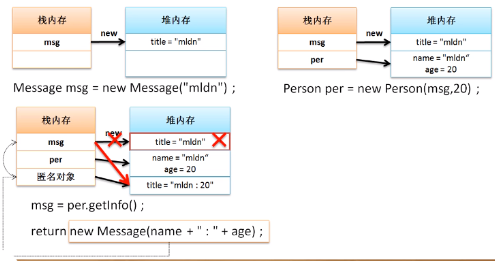

# 深入分析类与对象

## **成员属性封装**

在类之中的组成就是属性与方法，一般而言方法都是对外提供服务的，不会进行封装处理，而属性由于其需要较高的安全性，所以需要对其进行保护，这个时候就需要采用封装性对属性进行保护。

在默认的情况下，对于类中的属性是可以通过其它类利用对象进行调用的。

**范例：**属性不封装情况下的问题

```java
public class JavaDemo {
    public static void main(String args[]){
        Person per1 = new Person(); // 声明实例化对象
        per1.name = "张三";  // 在类外部修改属性
        per1.age = -18; // 在类外部修改属性
        per1.tell(); //进行方法的调用
    }
}
```

此时在Person类中提供的name和age两个属性并没有进行封装处理，这样外部就可以直接进行调用，但是有可能所设置的数据是错误的数据。如果想解决这样的问题可以利用private关键字对属性进行封装处理。

**范例：**对属性进行封装

```java
class Person{ // 定义一个类
    private String name;  // 人员的姓名
    private int age;  // 人员的年龄
    public void tell(){
        System.out.println("姓名："+ name +"、年龄：" + age);
    }
}
```

属性一旦封装之后将不能直接访问，即：对外部不可见，但是对类的内部可见，如果想让外部的程序访问封装的属性，则在Java开发标准中提供有如下要求：

- 【setter、getter】设置或取得属性可以使用setXxx()、getXxx()方法

  - 设置属性方法：public void setName（string n）
  - 获取属性方法：public String getName()

**范例：**实现封装

```java
class Person{ // 定义一个类
    private String name;  // 人员的姓名
    private int age;  // 人员的年龄
    public void tell(){
        System.out.println("姓名："+ name +"、年龄：" + age);
    }
    public void setName(String n){
        name = n;
    }
    public void setAge(int a){
        if (a >=0){
            age = a;
        }
    }
    public String getName(){
        return name;
    }
    public int getAge(){
        return age;
    }
}
public class JavaDemo {
    public static void main(String args[]){
        Person per = new Person(); // 声明实例化对象
        per.setName("张三");
        per.setAge(-18);
        per.tell(); //进行方法的调用
    }
}
```

在以后进行任何类定义时，**类中的所有属性必须使用private封装**，并且属性如要进行访问，必须提供setter与getter方法。

---

## **构造方法与匿名对象**

目前程序在使用类时都按照了如下的步骤进行：

- 声明并实例化对象，这个时候实例化对象中的属性并没有任何的数据存在，此时为对于数据的默认值
- 需要通过一系列的setter方法为类中的属性设置内容

要想真正获得一个可以正常使用的实例化对象，必须经过两个步骤才能完成

**范例：**传统调用

```java
public class JavaDemo {
    public static void main(String args[]){
        //1、对象初始化准备
        Person per = new Person(); // 声明实例化对象
        per.setName("张三");
        per.setAge(-18);
        //2、对象的使用
        per.tell(); //进行方法的调用
    }
}
```

假设类中的属性有很多个(8个)，此时则需要调用8次的setter方法进行内容设置，这样的调用太啰嗦了，所以在java中考虑到对象初始化的问题，专门提供有构造方法，即：<font color='red'>可以通过构造方法实现实例化对象中的属性初始化处理。</font>只有在关键字new的时候使用构造方法。在java程序中构造方法的定义要求如下：

1. 构造方法名称必须与类名称保存一致；
2. 构造方法不允许设置任何的返回值类型，即：没有返回值定义

构造方法是在使用关键字new实例化对象的时候自动调用的

**范例：**定义构造方法

```java
class Person{ // 定义一个类
    private String name;  // 人员的姓名
    private int age;  // 人员的年龄
    // 方法名称与类名称相同，并且无返回值定义
    public Person(String n,int a){ //定义有参构造
        name = n; //为类中的属性赋值(初始化）
        age = a; //为类中的属性赋值(初始化）
    }
    public void tell(){
        System.out.println("姓名："+ name +"、年龄：" + age);
    }
}
public class JavaDemo {
    public static void main(String args[]){
        //1、对象初始化准备
        Person per = new Person("张三",18); // 声明实例化对象
        //2、对象的使用
        per.tell(); //进行方法的调用
    }
}
```

针对当前的对象实例化格式与之前的对象实例化格式做一个比较：

- 之前的对象实例化格式：①Person ②per = ③new ④Person();

- 当前的对象实例化格式：①Person ②per = ③new ④Person("张三",18);

  - “①Person”：主要定义对象的所属类型，类型决定了你可以调用的方法
  - “②per”：实例化对象的名称，所有的操作通过对象来进行访问
  - “③new”：开辟一块新的堆内存空间
  - “④Person("张三",18)”：调用有参构造、“④Person()”：调用无参构造

在Java程序中考虑到程序结构的完整性，所以所有的类都会提供有构造方法，即：现在类中没有定义任何的构造方法，则一定会默认提供有一个无参的，什么都不做的构造方法，这个构造方法时在程序编译的时候自动创建的。如果现在已经在类中明确定义有一个构造方法，那么这个默认的构造方法将不会被自动创建。

**结论：一个类至少存在一个构造方法**

> **疑问：**为什么构造方法上不允许设置返回值类型？既然构造方法不会返回数据，为什么不使用<font color='red'>void</font>定义呢？
>
> **分析：**程序编译器是根据代码结构来进行编译处理的，执行的时候也是根据代码结构来处理的。<font color='red'>如果在构造方法上使用了void，那么此结构就与普通方法的结构完全相同了，那么此时编译器会认为此方法是一个普通方法，而普通方法与构造方法最大的区别在于构造方法是在类对象实例化的时候调用的，而普通方法是在类对象实例化产生之后调用的。</font>

既然构造方法本身是一个方法，那么方法就具有重载的特点，而构造方法重载时只需要考虑参数的类型和个数即可

**范例：**构造方法重载

```java
class Person{ // 定义一个类
    private String name;  // 人员的姓名
    private int age;  // 人员的年龄
    // 方法名称与类名称相同，并且无返回值定义
    public Person(){
        name = "无名氏";
        age = -1;
    }
    public Person(String n){
        name = n;
    }
    public Person(String n,int a){ //定义有参构造
        name = n; //为类中的属性赋值(初始化）
        age = a; //为类中的属性赋值(初始化）
    }
    public void tell(){
        System.out.println("姓名："+ name +"、年龄：" + age);
    }
}
public class JavaDemo {
    public static void main(String args[]){
        //1、对象初始化准备
        Person per = new Person(); // 声明实例化对象
        //2、对象的使用
        per.tell(); //进行方法的调用  姓名：无名氏、年龄：-1
    }
}
```

在进行多个构造方法定义时，建议大家有一些定义的顺序，例如：可以按照参数的个数降序或升序排列。

经过分析可以发现，构造方法可以进行数据的设置，而对于setter也可以进行数据的设置。构造方法时在对象实例化的时候为属性设置的初始化内容，而setter除了拥有设置数据的功能之外还有修改数据的功能。

**范例：**使用setter修改数据

```java
class Person{ // 定义一个类
    private String name;  // 人员的姓名
    private int age;  // 人员的年龄
    // 方法名称与类名称相同，并且无返回值定义
    public Person(String n,int a){ //定义有参构造
        name = n; //为类中的属性赋值(初始化）
        age = a; //为类中的属性赋值(初始化）
    }
    public void setName(String n){
        name = n;
    }
    public void setAge(int a){
        age = a;
    }
    public String getName(){
        return name;
    }
    public int getAge(){
        return age;
    }
    public void tell(){
        System.out.println("姓名："+ name +"、年龄：" + age);
    }
}
public class JavaDemo {
    public static void main(String args[]){
        //1、对象初始化准备
        Person per = new Person("张三",10); // 声明实例化对象
        //2、对象的使用
        per.setAge(17);//修改属性内容
        per.tell(); //进行方法的调用
    }
}
```

利用构造方法可以传递属性数据，于是进一步分析对象的产生格式：

- 定义对象的名称：类名称 对象名称 = null;
- 实例化对象：对象名称 = new 类名称();

如果只是通过实例化对象来进行类的操作也是可以的，而这种形式的对象没有名字就称为匿名对象

**范例：**观察匿名对象

```java
public class JavaDemo {
    public static void main(String args[]){
        new Person("张三",10).tell(); //进行方法的调用
    }
}
```

此时通过对象进行了类中tell()方法的调用，但是由于此对象没有任何的引用名称，所以该对象使用一次之后就将成为垃圾，而所有的垃圾将被GC进行回收与释放。

**范例：**编写一个分析程序，通过构造方法进行内存分析

```java
class Message{
    private String title;
    public Message(String t){
        title = t;
    }
    public String getTitle(){
        return title;
    }
    public void setTitle(String t){
        title = t;
    }
}
class Person{ // 定义一个类
    private String name;  // 人员的姓名
    private int age;  // 人员的年龄
    // 方法名称与类名称相同，并且无返回值定义
    public Person(Message msg,int a){ //定义有参构造
        name = msg.getTitle(); //为类中的属性赋值(初始化）
        age = a; //为类中的属性赋值(初始化）
    }
    public Message getInfo(){
        return new Message(name + ":" + age);
    }
    public void tell(){
        System.out.println("姓名："+ name +"、年龄：" + age);
    }
}
public class JavaDemo {
    public static void main(String args[]){
//        //1、对象初始化准备
        Message msg = new Message("mldn");
        Person per = new Person(msg,20); // 声明实例化对象
        msg = per.getInfo();
        System.out.println(msg.getTitle());
    }
}
```

通过此程序进行一个简单的内存分析：



